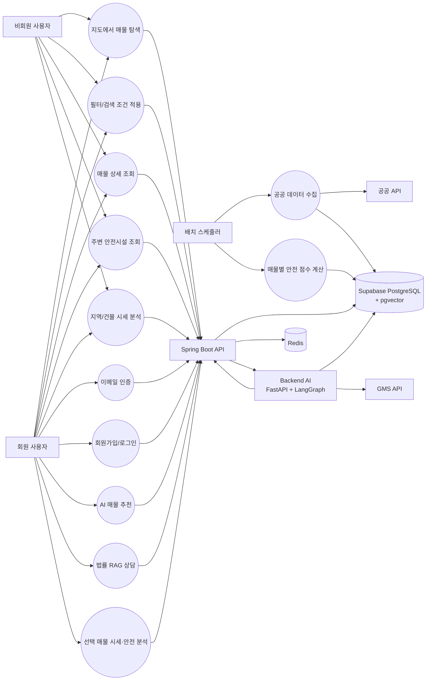

# UseCase Diagram

## 1. Actor 정의

| Actor | 설명 |
| --- | --- |
| 비회원 사용자 | 로그인 없이 지도 기반 매물 탐색과 기본 조회를 수행하는 사용자 |
| 회원 사용자 | 로그인 후 AI 챗봇, 법률 상담, 분석 기능을 사용하는 사용자 |
| Spring Boot API | 프론트엔드 요청을 받는 메인 API 서버 |
| Backend AI | FastAPI + LangGraph 기반 AI 에이전트 서버 |
| 배치 스케줄러 | 실거래가/안전시설 수집과 점수 계산을 수행하는 Spring Scheduler |
| 공공 API | 국토교통부 실거래가, 생활안전지도/재난안전 데이터 원천 |
| GMS API | OpenAI-compatible LLM API |

## 2. 전체 UseCase Diagram

## 3. 주요 UseCase 명세

### UC-01 지도에서 매물 탐색

| 항목 | 내용 |
| --- | --- |
| Actor | 비회원 사용자, 회원 사용자 |
| 선행조건 | 프론트엔드에서 지도 SDK가 로드되어야 한다. |
| 기본 흐름 | 지도 bounds와 zoom을 Spring Boot `/api/v1/map/viewport`로 전달한다. 서버는 zoom에 따라 지역 평균, 클러스터, 개별 매물을 반환한다. |
| 대안 흐름 | 지도 SDK 로드 실패 시 기본 bounds로 매물 목록을 조회한다. |
| 결과 | 지도 마커/클러스터/지역 평균과 우측 목록이 갱신된다. |

### UC-02 AI 매물 추천

| 항목 | 내용 |
| --- | --- |
| Actor | 회원 사용자 |
| 선행조건 | 로그인 및 JWT 보유 |
| 기본 흐름 | 사용자가 자연어 조건 입력 → Spring Boot `/api/v1/chat` 호출 → JWT 검증 → backend-ai 내부 API 호출 → supervisor가 `PROPERTY_SEARCH` 선택 → Supabase 매물 조회 → 답변과 매물 카드 반환 |
| 결과 | 챗봇 메시지와 추천 매물 카드가 표시된다. |

### UC-03 법률 RAG 상담

| 항목 | 내용 |
| --- | --- |
| Actor | 회원 사용자 |
| 선행조건 | 로그인 및 법률 chunk/embedding 데이터 준비 |
| 기본 흐름 | 사용자가 법률 질문 입력 → supervisor가 `LEGAL_CONSULT` 선택 → pgvector 유사도 검색 → 법령 카드와 AI 해설 생성 |
| 결과 | 법령명, 조항, 조항 요약, 유사도 점수가 포함된 카드가 표시된다. |

### UC-04 선택 매물 시세·안전 분석

| 항목 | 내용 |
| --- | --- |
| Actor | 회원 사용자 |
| 선행조건 | 사용자가 지도 또는 상세 화면에서 매물을 선택 |
| 기본 흐름 | 선택 매물 ID와 질문을 전송 → backend-ai가 `PRICE_ANALYSIS`, `SAFETY_ANALYSIS` 워커 실행 → Spring Boot 시세/안전 API 호출 → 분석 카드 반환 |
| 예외 흐름 | 선택 매물 ID가 없으면 선택 필요 안내를 반환한다. |

### UC-05 공공 데이터 수집 및 점수 계산

| 항목 | 내용 |
| --- | --- |
| Actor | 배치 스케줄러 |
| 기본 흐름 | 실거래가/안전시설 API 호출 → 정규화 → DB upsert → 지역/건물 시세 통계 및 안전 점수 계산 |
| 결과 | 런타임 API는 외부 API 대신 저장된 DB 데이터를 조회한다. |

