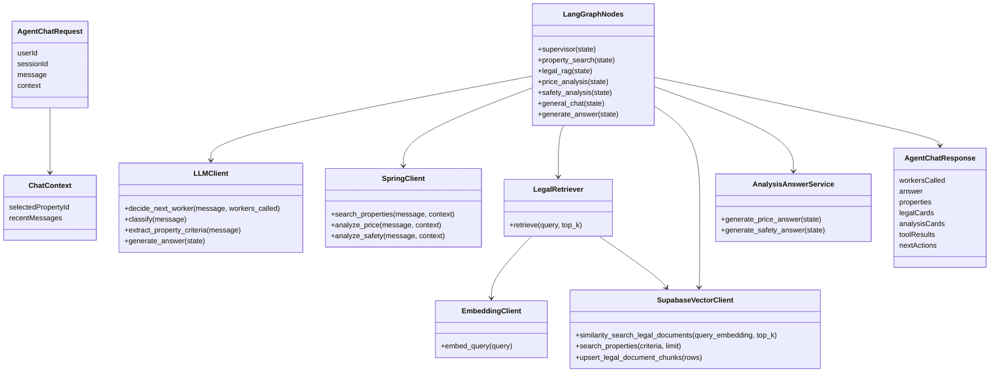
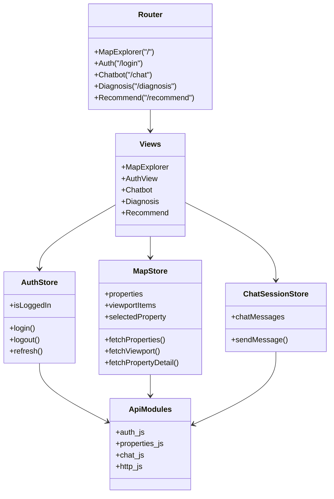

# Class Diagram

## 1. Spring Boot 주요 클래스

```mermaid
classDiagram
    class SecurityConfig {
        +filterChain(HttpSecurity) SecurityFilterChain
        +passwordEncoder() PasswordEncoder
    }

    class JwtAuthenticationFilter {
        +doFilterInternal()
    }

    class AuthController {
        +signup(SignupRequest)
        +login(LoginRequest)
        +logout(User)
        +refresh(RefreshRequest)
        +sendVerificationEmail(EmailSendRequest)
        +verifyEmail(EmailVerifyRequest)
    }

    class AuthService {
        +signup(email, password, nickname)
        +login(email, password) LoginResponse
        +refresh(refreshToken) RefreshResponse
        +logout(email)
    }

    class EmailVerificationService {
        +sendCode(email)
        +verifyCode(email, code)
    }

    class UserDao {
        <<interface>>
        +findByEmail(email) User
        +save(User)
    }

    class PropertyController {
        +searchProperties(...)
        +getProperty(propertyId)
        +getPropertyTransactions(propertyId, years)
        +getPropertySafetySummary(propertyId, radius)
    }

    class PropertyService {
        <<interface>>
        +searchProperties(criteria)
        +getProperty(propertyId)
        +getTransactions(propertyId, years)
        +getSafetySummary(propertyId, radius)
        +getPriceAnalysis(legalDongCode, propertyType, transactionType)
    }

    class PropertyServiceImpl {
        +searchProperties(criteria)
        +getProperty(propertyId)
        +getTransactions(propertyId, years)
        +getSafetySummary(propertyId, radius)
        +getPriceAnalysis(...)
    }

    class PropertyDao {
        <<interface>>
        +findInBounds(criteria)
        +findViewportProperties(criteria, limit)
        +findRegionAverageViewportItems(criteria, level, limit)
        +findPropertyClusters(criteria, gridSize, limit)
        +findActiveById(propertyId)
        +findComparableTransactions(property, minYm)
        +findSafetySummary(propertyId, radius)
    }

    class JdbcPropertyDao

    class MapViewportController {
        +getViewport(...)
    }

    class MapViewportService {
        <<interface>>
        +getViewport(request)
    }

    class MapViewportServiceImpl {
        +getViewport(request)
        -resolveMode(zoom)
        -clusterGridSize(zoom)
    }

    class SafetyFacilityController {
        +getFacilities(...)
    }

    class SafetyFacilityService {
        <<interface>>
        +findFacilities(request)
    }

    class SafetyFacilityServiceImpl

    class SafetyFacilityDao {
        <<interface>>
        +findInBounds(types, west, east, south, north)
        +upsert(row)
        +upsertAll(rows)
    }

    class JdbcSafetyFacilityDao

    class PropertySafetyScoreService {
        <<interface>>
        +recalculateAll()
        +calculateScore(input)
    }

    class PropertySafetyScoreServiceImpl {
        +recalculateAll()
        +calculateScore(input)
    }

    class ChatController {
        +sendMessage(User, ChatRequest)
    }

    class ChatService {
        <<interface>>
        +sendMessage(User, ChatRequest)
    }

    class ChatServiceImpl

    class AiAgentClient {
        +sendMessage(userId, ChatRequest) ChatResponse
    }

    class PriceAnalysisController {
        +getPriceAnalysis(...)
    }

    SecurityConfig --> JwtAuthenticationFilter
    AuthController --> AuthService
    AuthController --> EmailVerificationService
    AuthService --> UserDao
    PropertyController --> PropertyService
    PropertyService <|.. PropertyServiceImpl
    PropertyServiceImpl --> PropertyDao
    PropertyDao <|.. JdbcPropertyDao
    MapViewportController --> MapViewportService
    MapViewportService <|.. MapViewportServiceImpl
    MapViewportServiceImpl --> PropertyDao
    SafetyFacilityController --> SafetyFacilityService
    SafetyFacilityService <|.. SafetyFacilityServiceImpl
    SafetyFacilityServiceImpl --> SafetyFacilityDao
    SafetyFacilityDao <|.. JdbcSafetyFacilityDao
    PropertySafetyScoreService <|.. PropertySafetyScoreServiceImpl
    PropertySafetyScoreServiceImpl --> PropertyDao
    PropertySafetyScoreServiceImpl --> SafetyFacilityDao
    ChatController --> ChatService
    ChatService <|.. ChatServiceImpl
    ChatServiceImpl --> AiAgentClient
    PriceAnalysisController --> PropertyService
```

## 2. Backend AI 주요 클래스/모듈

```mermaid
classDiagram
    class AgentChatRequest {
        userId
        sessionId
        message
        context
    }

    class AgentChatResponse {
        workersCalled
        answer
        properties
        legalCards
        analysisCards
        toolResults
        nextActions
    }

    class ChatContext {
        selectedPropertyId
        recentMessages
    }

    class LLMClient {
        +decide_next_worker(message, workers_called)
        +classify(message)
        +extract_property_criteria(message)
        +generate_answer(state)
    }

    class SpringClient {
        +search_properties(message, context)
        +analyze_price(message, context)
        +analyze_safety(message, context)
    }

    class SupabaseVectorClient {
        +similarity_search_legal_documents(query_embedding, top_k)
        +search_properties(criteria, limit)
        +upsert_legal_document_chunks(rows)
    }

    class EmbeddingClient {
        +embed_query(query)
    }

    class LegalRetriever {
        +retrieve(query, top_k)
    }

    class AnalysisAnswerService {
        +generate_price_answer(state)
        +generate_safety_answer(state)
    }

    class LangGraphNodes {
        +supervisor(state)
        +property_search(state)
        +legal_rag(state)
        +price_analysis(state)
        +safety_analysis(state)
        +general_chat(state)
        +generate_answer(state)
    }

    AgentChatRequest --> ChatContext
    LangGraphNodes --> LLMClient
    LangGraphNodes --> SpringClient
    LangGraphNodes --> LegalRetriever
    LangGraphNodes --> SupabaseVectorClient
    LegalRetriever --> EmbeddingClient
    LegalRetriever --> SupabaseVectorClient
    LangGraphNodes --> AnalysisAnswerService
    LangGraphNodes --> AgentChatResponse
```

## 3. Frontend 주요 모듈

```mermaid
classDiagram
    class Router {
        +MapExplorer("/")
        +Auth("/login")
        +Chatbot("/chat")
        +Diagnosis("/diagnosis")
        +Recommend("/recommend")
    }

    class AuthStore {
        +isLoggedIn
        +login()
        +logout()
        +refresh()
    }

    class MapStore {
        +properties
        +viewportItems
        +selectedProperty
        +fetchProperties()
        +fetchViewport()
        +fetchPropertyDetail()
    }

    class ChatSessionStore {
        +chatMessages
        +sendMessage()
    }

    class ApiModules {
        +auth_js
        +properties_js
        +chat_js
        +http_js
    }

    class Views {
        +MapExplorer
        +AuthView
        +Chatbot
        +Diagnosis
        +Recommend
    }

    Router --> Views
    Views --> AuthStore
    Views --> MapStore
    Views --> ChatSessionStore
    AuthStore --> ApiModules
    MapStore --> ApiModules
    ChatSessionStore --> ApiModules
```
