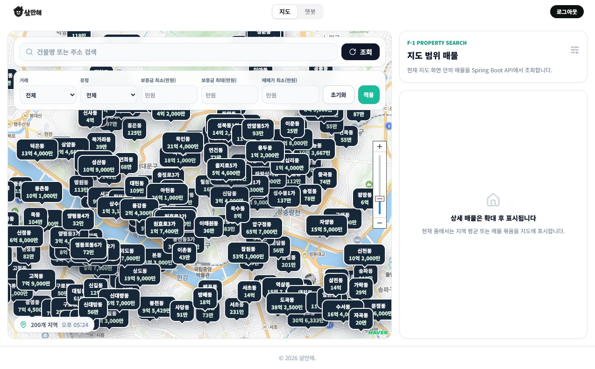
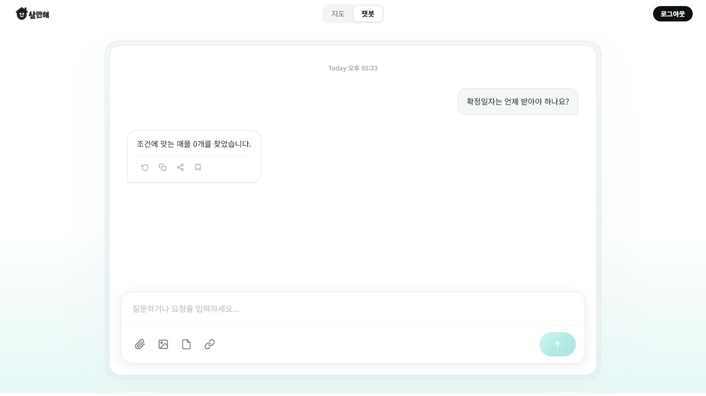
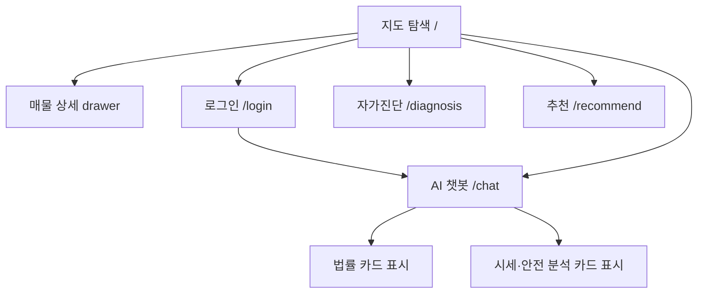

# 화면정의서

## 1. 화면 목록

배포 확인 URL: https://salmanhae.vercel.app/  
확인일: 2026-06-25

| 화면 ID | Route | 화면명 | 구현 파일 | 인증 | 목적 |
| --- | --- | --- | --- | --- | --- |
| SCR-01 | `/` | 지도 탐색 | `frontend/src/views/MapExplorer.vue` | 공개 | 지도 기반 매물 탐색, 필터, 상세 확인 |
| SCR-02 | `/login` | 인증 | `frontend/src/views/AuthView.vue` | 공개 | 로그인, 이메일 인증, 회원가입 |
| SCR-03 | `/chat` | AI 챗봇 | `frontend/src/views/Chatbot.vue` | 필요 | AI 매물 추천, 법률 상담, 시세/안전 분석 |
| SCR-04 | `/diagnosis` | HUG/권리관계 자가진단 | `frontend/src/views/Diagnosis.vue` | 공개 화면 | 보증보험/권리관계 입력 기반 자가진단 UI |
| SCR-05 | `/recommend` | 추천/가중치 화면 | `frontend/src/views/Recommend.vue` | 공개 화면 | 선호도 가중치 기반 추천 UI |
| SCR-06 | `/community` | 커뮤니티 | `frontend/src/views/Community.vue` | 공개 화면 | 실거주 후기 UI, MVP 제외 기능으로 발표 시 주의 |

## 2. 공통 레이아웃

| 영역 | 내용 |
| --- | --- |
| Header | 좌측 로고, 중앙 `지도`/`챗봇` segmented navigation, 우측 로그인/로그아웃 |
| Main | 라우터별 화면 렌더링 |
| Footer | 인증/챗봇 외 화면에서 간단한 copyright 표시 |
| 인증 가드 | `/chat` 접근 시 미로그인 사용자는 `/login?redirect=/chat`으로 이동 |

### 배포 확인 메모

- 루트 URL은 정상 진입한다.
- 현재 Vercel 배포에서는 `/login`, `/chat` 직접 URL 진입 시 404가 발생할 수 있으므로 시연은 루트에서 헤더 네비게이션을 눌러 이동한다.
- 미로그인 상태에서 `챗봇`을 누르면 `/login?redirect=/chat` 로그인 화면으로 이동한다.
- 로그인 성공 후 자동으로 `/chat`에 복귀하지 않고 루트 화면으로 이동하는 흐름이 관찰되므로, 시연에서는 로그인 후 다시 `챗봇`을 클릭한다.

## 3. SCR-01 지도 탐색

### 목적

사용자가 네이버지도 기반으로 매물 위치, 가격, 지역 평균, 클러스터, 상세 정보를 탐색한다.

### 주요 UI 구성

| 영역 | 컴포넌트/요소 | 설명 |
| --- | --- | --- |
| 검색바 | 키워드 입력, 새로고침 버튼 | 건물명/주소/제목 검색 |
| 필터 영역 | 거래유형, 매물유형, 보증금/매매가 입력, 초기화/적용 | API query parameter로 변환 |
| 지도 영역 | Naver Maps SDK, 다크 네이비 지역 평균 마커 | zoom에 따라 지역 평균/클러스터/개별 매물 표시 |
| 상태 표시 | `200개 지역`, 마지막 조회 시간 | 지도 좌하단 pill 형태로 표시 |
| 우측 패널 | `F-1 Property Search`, `지도 범위 매물` 카드, 빈 상태 카드 | 현재 줌에서 상세 매물 대신 지역 평균/묶음이 보일 때 안내 |
| 상세 패널 | 가격, 면적, 층수, 주소, 설명 | 매물 카드 클릭 시 우측 drawer로 표시 |

### 배포 화면 캡처

### 연결 API

| 이벤트 | API |
| --- | --- |
| 지도 이동/zoom 변경 | `GET /api/v1/map/viewport` |
| 필터 적용 | `GET /api/v1/map/viewport`, `GET /api/v1/properties` |
| 매물 선택 | `GET /api/v1/properties/{propertyId}` |

### 상태

| 상태 | 표시 |
| --- | --- |
| 로딩 | 지도/목록 로딩 spinner |
| API 오류 | 오류 카드와 메시지 |
| 지도 SDK 실패 | fallback 안내 및 기본 매물 목록 |
| 결과 없음 | 빈 상태 메시지 |

## 4. SCR-02 인증

### 목적

이메일 인증 기반 회원가입과 로그인을 제공한다.

### 주요 UI 구성

| 모드 | 입력 | 동작 |
| --- | --- | --- |
| 로그인 | email, password | 로그인 후 token 저장, redirect 처리 |
| 이메일 인증 요청 | email | 인증 코드 발송 |
| 인증 코드 검증 | email, code | 인증 완료 상태 전환 |
| 회원가입 | email, password, nickname | 회원가입 후 로그인 가능 |

### 연결 API

| 이벤트 | API |
| --- | --- |
| 인증 코드 발송 | `POST /api/v1/auth/email/send` |
| 인증 코드 검증 | `POST /api/v1/auth/email/verify` |
| 회원가입 | `POST /api/v1/auth/signup` |
| 로그인 | `POST /api/v1/auth/login` |

## 5. SCR-03 AI 챗봇

### 목적

로그인 사용자가 자연어로 매물 추천, 법률 상담, 시세/안전 분석을 요청한다.

### 주요 UI 구성

| 영역 | 설명 |
| --- | --- |
| Welcome | `안녕하세요! 무엇이 궁금하신가요?` 문구와 4개 예시 질문 |
| 예시 질문 | 확정일자, 전세 보증금 회수 순서, 안전 점수 확인, 전세사기 특별법 질문 |
| Message List | 사용자 메시지는 우측 bubble, AI 메시지는 좌측 카드/bubble |
| Legal Cards | 법령명, 조항, 제목, 내용, 유사도 표시 |
| Analysis Cards | PRICE/SAFETY 카드, 점수, 주요 metric 표시 |
| Composer | 하단 고정 입력창, 파일/이미지/문서/링크 아이콘, 전송 버튼 |
| Message Actions | 다시 생성, 복사, 공유, 저장 아이콘 UI |

### 연결 API

| 이벤트 | API |
| --- | --- |
| 메시지 전송 | `POST /api/v1/chat` |

### 응답 표시 규칙

| 응답 필드 | 표시 |
| --- | --- |
| `message`/`answer` | AI bubble 본문 |
| `legalCards` | 법률 근거 카드 리스트 |
| `analysisCards` | 시세/안전 분석 카드 |
| `properties` | 추천 매물 카드, 지도 연동 확장 가능 |

### 배포 확인 결과

- 로그인 후 헤더 `챗봇`을 클릭하면 `/chat` 화면이 표시된다.
- 첫 진입 시 예시 질문 4개가 보이고, 질문을 선택하면 날짜 구분선과 사용자/AI 메시지 bubble이 생성된다.
- 확인 시점의 예시 질문 `확정일자는 언제 받아야 하나요?`는 `조건에 맞는 매물 0개를 찾았습니다.`라는 텍스트 응답으로 표시되었다. 법률 카드가 항상 표시되는 상태는 아니므로, 발표 시에는 "카드형 UI를 지원하는 구조"와 "현재 배포 응답 예시"를 구분해 설명한다.

### 배포 화면 캡처

## 6. SCR-04 HUG/권리관계 자가진단

### 목적

사용자가 주택 유형, 보증금, 선순위 채무, 세금 확인 여부 등을 입력해 위험도를 자가진단한다.

### 구현 상태

- 프론트엔드 화면은 존재한다.
- PRD상 F-5는 1.5차 기능이며 정밀 HUG 판정은 MVP 제외/확장으로 구분한다.
- 발표 시에는 "자가진단 UI 시안/확장 기능"으로 소개하는 것이 안전하다.

## 7. SCR-05 추천/가중치 화면

### 목적

치안, 가격, 교통 등 선호 가중치를 조정해 추천 결과를 보는 화면이다.

### 구현 상태

- 프론트엔드 UI는 존재한다.
- 실제 AI 추천 API의 핵심 진입점은 `/chat`이므로, 제출 시 이 화면은 보조/확장 화면으로 설명한다.

## 8. SCR-06 커뮤니티

### 목적

실거주 후기/지역 토크룸 형태의 UI를 제공한다.

### 구현 상태

- PRD에서는 커뮤니티가 MVP 제외로 명시되어 있다.
- 화면 파일은 존재하지만 제출 범위에서는 제외 또는 프로토타입으로 설명한다.

## 9. 화면 흐름

