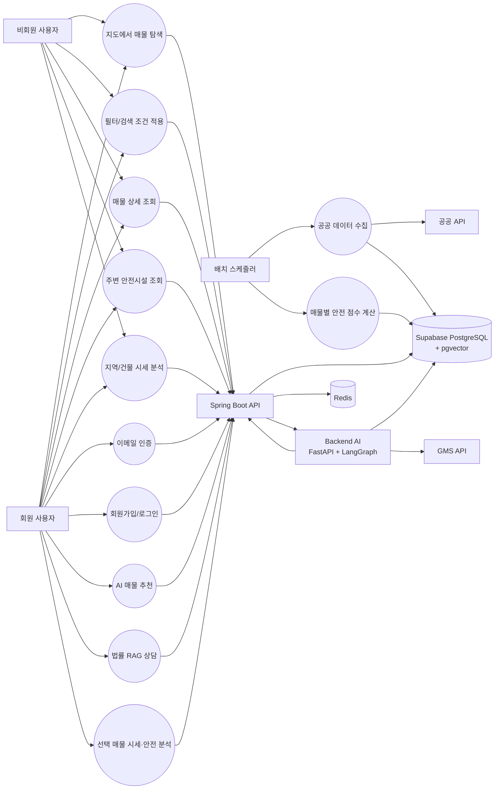

# UseCase Diagram

## 1. Actor 정의

| Actor | 설명 |
| --- | --- |
| 비회원 사용자 | 로그인 없이 지도 기반 매물 탐색, 매물 상세, 실거래가/안전시설/시세 기본 조회를 수행하는 사용자 |
| 회원 사용자 | 로그인 후 AI 챗봇으로 매물 추천, 법률 상담, 선택 매물 분석을 사용하는 사용자 |
| Spring Boot API | 프론트엔드 요청을 받는 메인 API 서버. 인증, 매물, 지도, 안전시설, 시세, 챗봇 프록시를 담당 |
| Backend AI | FastAPI + LangGraph 기반 내부 AI 에이전트 서버 |
| 배치 스케줄러 | 안전시설 수집과 매물별 안전 점수 계산을 수행하는 Spring Scheduler |
| 공공 API | 국토교통부 실거래가, 생활안전지도/재난안전 데이터 원천 |
| GMS API | OpenAI-compatible LLM API |
| Supabase | PostgreSQL 데이터베이스와 pgvector 법률 RAG 저장소 |
| Redis | 이메일 인증 코드, 인증 완료 플래그, refresh token 저장소 |

## 2. 전체 UseCase Diagram

## 3. 주요 UseCase 명세

### UC-01 지도에서 매물 탐색

| 항목 | 내용 |
| --- | --- |
| Actor | 비회원 사용자, 회원 사용자 |
| 선행조건 | 프론트엔드에서 네이버지도 SDK가 로드되어야 한다. |
| 기본 흐름 | 지도 bounds와 zoom을 Spring Boot `/api/v1/map/viewport`로 전달한다. 서버는 zoom에 따라 지역 평균, 클러스터, 개별 매물 모드를 결정해 반환한다. |
| 대안 흐름 | 지도 SDK 로드 실패 시 기본 bounds 기준 조회 흐름으로 안내한다. |
| 결과 | 지도 마커/클러스터/지역 평균과 우측 목록 또는 상세 패널이 갱신된다. |

### UC-02 필터/검색 조건 적용

| 항목 | 내용 |
| --- | --- |
| Actor | 비회원 사용자, 회원 사용자 |
| 기본 흐름 | 사용자가 거래유형, 매물유형, 가격 범위, 키워드를 입력한다. 프론트엔드는 금액 입력을 원 단위 query parameter로 변환해 `/api/v1/map/viewport` 또는 `/api/v1/properties`를 호출한다. |
| 결과 | 조건에 맞는 지도 표시 데이터와 매물 목록이 갱신된다. |

### UC-03 매물 상세 및 주변 데이터 조회

| 항목 | 내용 |
| --- | --- |
| Actor | 비회원 사용자, 회원 사용자 |
| 기본 흐름 | 사용자가 매물 마커나 목록 카드를 선택한다. Spring Boot는 `/api/v1/properties/{propertyId}`, `/transactions`, `/safety-summary`를 통해 상세, 주변 실거래가, 사전 계산 안전 요약을 반환한다. |
| 결과 | 상세 drawer에 가격, 면적, 주소, 설명, 주변 실거래가와 안전 요약이 표시된다. |

### UC-04 AI 매물 추천

| 항목 | 내용 |
| --- | --- |
| Actor | 회원 사용자 |
| 선행조건 | 로그인 및 JWT 보유 |
| 기본 흐름 | 사용자가 자연어 조건을 입력한다. Spring Boot `/api/v1/chat`이 JWT를 검증한 뒤 backend-ai `/internal/agent/chat`을 호출한다. LangGraph supervisor가 `PROPERTY_SEARCH` worker를 선택하고 Supabase에서 조건에 맞는 매물을 조회한다. |
| 결과 | 챗봇 메시지와 추천 매물 카드가 표시된다. |

### UC-05 법률 RAG 상담

| 항목 | 내용 |
| --- | --- |
| Actor | 회원 사용자 |
| 선행조건 | 법률 chunk와 embedding 데이터가 Supabase pgvector에 적재되어 있어야 한다. |
| 기본 흐름 | 사용자가 임대차 법률 질문을 입력한다. backend-ai supervisor가 `LEGAL_CONSULT` worker를 선택하고 pgvector 유사도 검색으로 관련 법령 chunk를 찾은 뒤 LLM 답변을 생성한다. |
| 결과 | 법령명, 조항, 제목, 요약, 유사도 점수가 포함된 법률 카드와 자연어 답변이 표시된다. |

### UC-06 선택 매물 시세·안전 분석

| 항목 | 내용 |
| --- | --- |
| Actor | 회원 사용자 |
| 선행조건 | 사용자가 지도 또는 상세 화면에서 분석 대상 매물을 선택 |
| 기본 흐름 | 선택 매물 ID와 질문을 `/api/v1/chat`으로 전송한다. backend-ai가 `PRICE_ANALYSIS`, `SAFETY_ANALYSIS` worker를 실행하고 Spring Boot의 매물/시세/안전 요약 API를 호출한다. |
| 예외 흐름 | 선택 매물 ID가 없으면 분석할 매물을 먼저 선택하라는 안내를 반환한다. |
| 결과 | 시세 분석 카드와 안전 분석 카드가 챗봇 메시지에 표시된다. |

### UC-07 공공 데이터 수집 및 점수 계산

| 항목 | 내용 |
| --- | --- |
| Actor | 배치 스케줄러 |
| 기본 흐름 | 공공 API 데이터를 수집해 정규화한 뒤 DB에 upsert한다. 안전시설 데이터와 활성 매물 좌표를 기준으로 반경별 시설 수와 안전 점수를 계산해 `property_score_stat`에 저장한다. |
| 결과 | 런타임 API는 외부 공공 API를 직접 호출하지 않고 저장된 DB 데이터만 조회한다. |

## 4. 인증/접근 범위

| 구분 | 사용 가능한 UseCase |
| --- | --- |
| 비회원 사용자 | 지도 탐색, 필터 검색, 매물 상세, 주변 안전시설, 시세 분석 |
| 회원 사용자 | 비회원 기능 전체, AI 매물 추천, 법률 RAG 상담, 선택 매물 시세·안전 분석 |

## 5. 시스템 경계

- AI 에이전트와 LLM 호출은 backend-ai에만 존재한다.
- Spring Boot는 LLM을 직접 호출하지 않고 내부 HTTP로 backend-ai를 호출한다.
- Frontend는 FastAPI를 직접 호출하지 않는다.
- pgvector 유사도 검색은 backend-ai에서만 수행한다.
- 공공 API 데이터는 요청 시점이 아니라 배치/파이프라인을 통해 저장된 DB 데이터를 조회한다.
