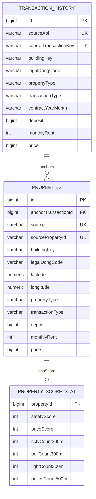
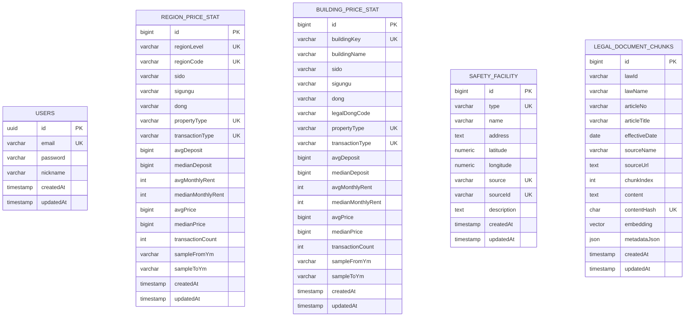

# ERD

## 1. 테이블 목록

| 테이블 | 용도 |
| --- | --- |
| `users` | Spring Security 사용자 인증 정보 |
| `transaction_history` | 국토교통부 실거래가 정규화 데이터 |
| `properties` | 지도에 표시할 매물 후보 |
| `region_price_stat` | 지도 줌 레벨별 지역 단위 시세 통계 |
| `building_price_stat` | 건물 anchor 단위 시세 통계 |
| `safety_facility` | CCTV, 비상벨, 보안등, 치안시설 좌표 |
| `property_score_stat` | 매물별 안전/가격 점수 사전 계산 결과 |
| `legal_document_chunks` | 법률 RAG chunk 및 embedding |
| `schema_migrations` | DB migration 적용 이력 |

`schema_migrations`는 migration 적용 이력을 관리하는 메타 테이블이므로 업무 ERD 관계도에서는 제외한다.

## 2. 핵심 관계 ERD

핵심 관계도는 주요 키와 조회 필드 중심으로 표시한다. 전체 컬럼은 테이블 목록과 인덱스 표에서 함께 확인한다.

## 3. 독립 테이블

## 4. 업무 키 기반 조회 관계

물리적인 Foreign Key는 아니지만, 서비스 로직에서는 아래 업무 키를 기준으로 조회와 집계가 이루어진다.

| 기준 테이블 | 참조 테이블 | 연결 기준 | 용도 |
| --- | --- | --- | --- |
| `properties` | `region_price_stat` | `legal_dong_code`, `property_type`, `transaction_type` | 지역 단위 시세 분석 |
| `properties` | `building_price_stat` | `building_key`, `property_type`, `transaction_type` | 건물 단위 시세 분석 |
| `properties` | `safety_facility` | `latitude`, `longitude` 반경 검색 | 매물별 안전시설 개수 계산 |
| `legal_document_chunks` | backend-ai RAG | `embedding`, `metadata_json` | 법률 문서 유사도 검색 |

## 5. Foreign Key

| From | To | 관계 | 삭제 규칙 |
| --- | --- | --- | --- |
| `properties.anchor_transaction_id` | `transaction_history.id` | 매물 seed가 기준 실거래가 row를 참조 | `NO ACTION` |
| `property_score_stat.property_id` | `properties.id` | 매물별 점수 row가 매물 row를 참조 | `CASCADE` |

## 6. 주요 Unique/Index

| 테이블 | 제약/인덱스 | 컬럼 |
| --- | --- | --- |
| `users` | `users_email_key` | `email` |
| `transaction_history` | `transaction_history_source_unique` | `source_api`, `source_transaction_key` |
| `transaction_history` | `idx_transaction_history_building` | `building_key`, `contract_year_month desc` |
| `transaction_history` | `idx_transaction_history_match` | `legal_dong_code`, `property_type`, `transaction_type`, `area_m2`, `contract_year_month desc` |
| `properties` | `properties_source_unique` | `source`, `source_property_id` |
| `properties` | `idx_properties_viewport` | `is_active`, `longitude`, `latitude` |
| `properties` | `idx_properties_filters` | `transaction_type`, `property_type`, `deposit`, `price` |
| `properties` | `idx_properties_region` | `sido`, `sigungu`, `dong` |
| `properties` | `idx_properties_building` | `building_key` |
| `region_price_stat` | `region_price_stat_unique` | `region_level`, `region_code`, `property_type`, `transaction_type` |
| `building_price_stat` | `building_price_stat_unique` | `building_key`, `property_type`, `transaction_type` |
| `building_price_stat` | `idx_building_price_stat_region` | `legal_dong_code`, `property_type`, `transaction_type` |
| `safety_facility` | `uq_safety_facility_source` | `type`, `source`, `source_id` |
| `safety_facility` | `idx_safety_facility_bounds` | `longitude`, `latitude` |
| `safety_facility` | `idx_safety_facility_type_bounds` | `type`, `longitude`, `latitude` |
| `legal_document_chunks` | `legal_document_chunks_content_hash_unique` | `content_hash` |
| `legal_document_chunks` | `idx_legal_document_chunks_law_article` | `law_id`, `article_no`, `chunk_index` |
| `legal_document_chunks` | `idx_legal_document_chunks_law_name` | `law_name` |
| `legal_document_chunks` | `idx_legal_document_chunks_embedding` | `embedding vector_cosine_ops`, `embedding is not null` |
| `legal_document_chunks` | `idx_legal_document_chunks_metadata` | `metadata_json` GIN |

## 7. 확장 예정 모델

| 모델 | 용도 |
| --- | --- |
| `wishlist` | 찜한 매물 |
| `conversation_session` | AI 대화 세션 |
| `conversation_message` | 대화 메시지 및 참조 메타데이터 |
