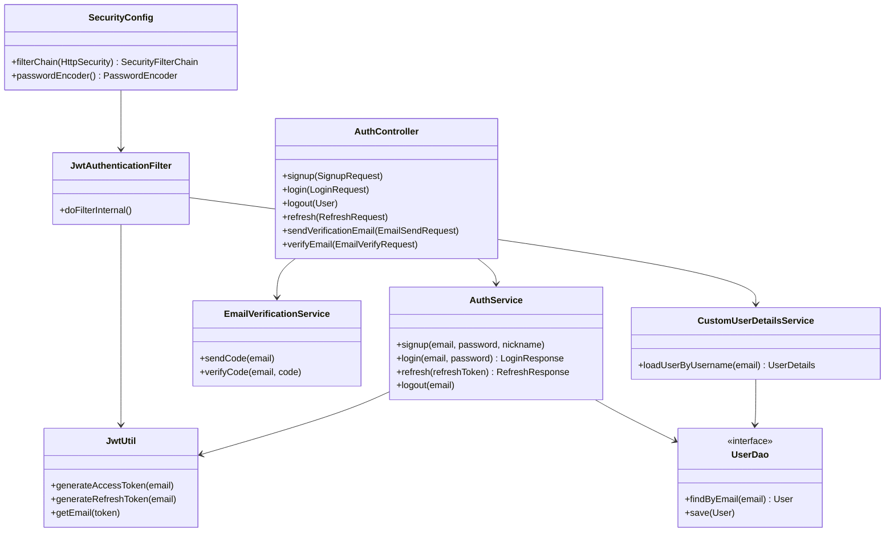
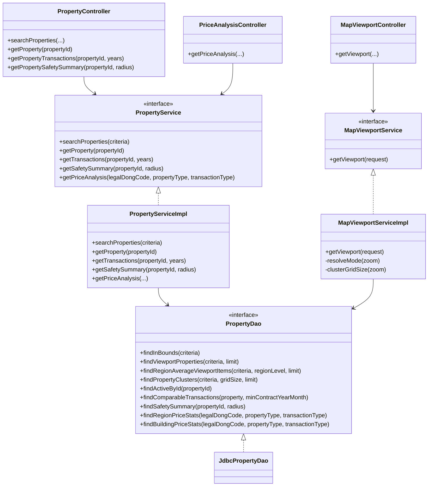
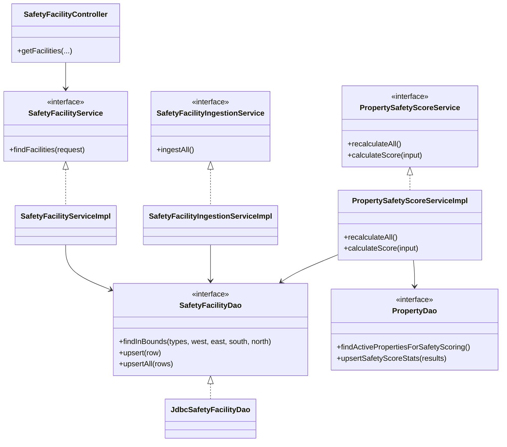
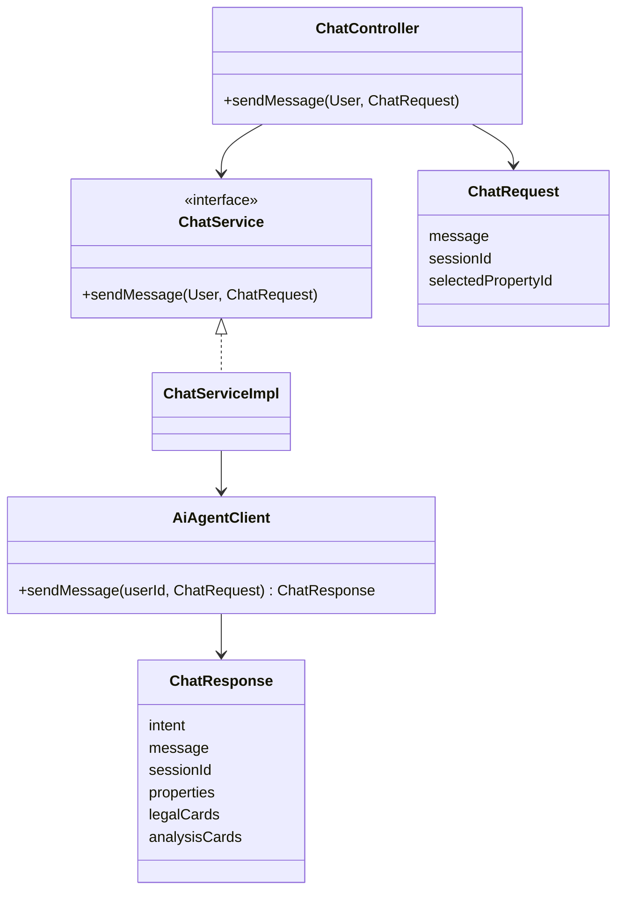
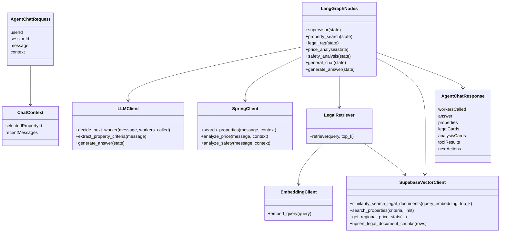
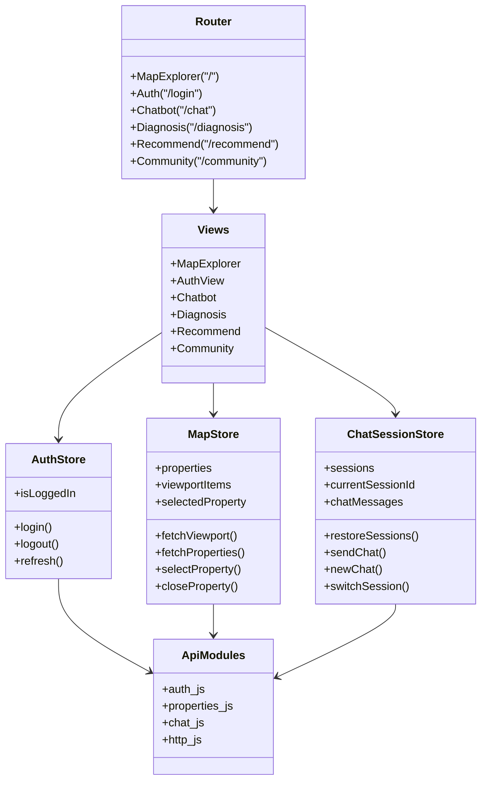

# Class Diagram

## 1. Spring Boot 인증/보안

## 2. Spring Boot 매물/지도/시세

## 3. Spring Boot 안전시설/점수 배치

## 4. Spring Boot AI 챗봇 연동

## 5. Backend AI 주요 클래스/모듈

## 6. Frontend 주요 모듈

## 7. 레이어별 책임

| 레이어 | 책임 |
| --- | --- |
| Controller / Router | 입력값 수신, 기본 검증, Service 또는 Graph로 위임 |
| Service | 비즈니스 로직 처리 |
| DAO / Client | DB 조회, 내부 HTTP 호출, Supabase 접근 |
| DTO / Schema | API request/response 계약 정의 |
| Store | 프론트엔드 화면 상태와 API 호출 흐름 관리 |
