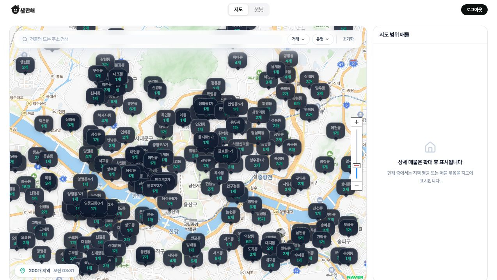
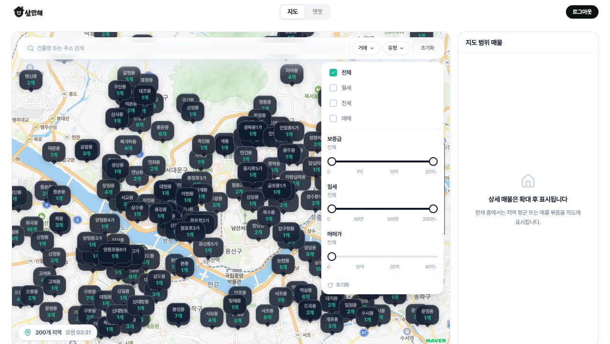
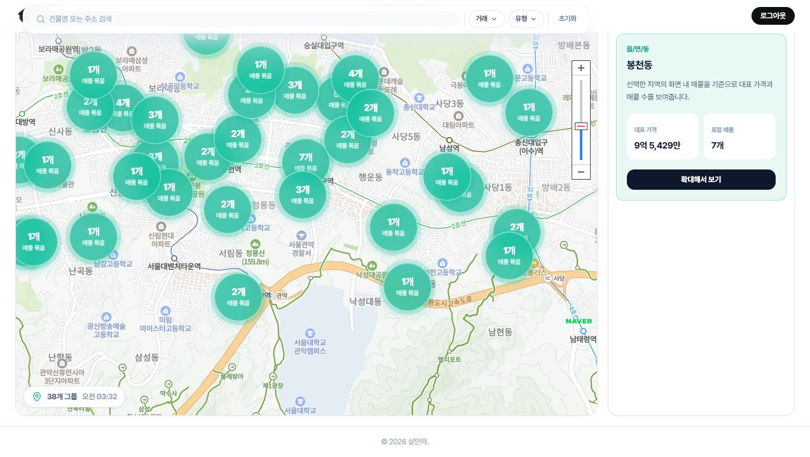
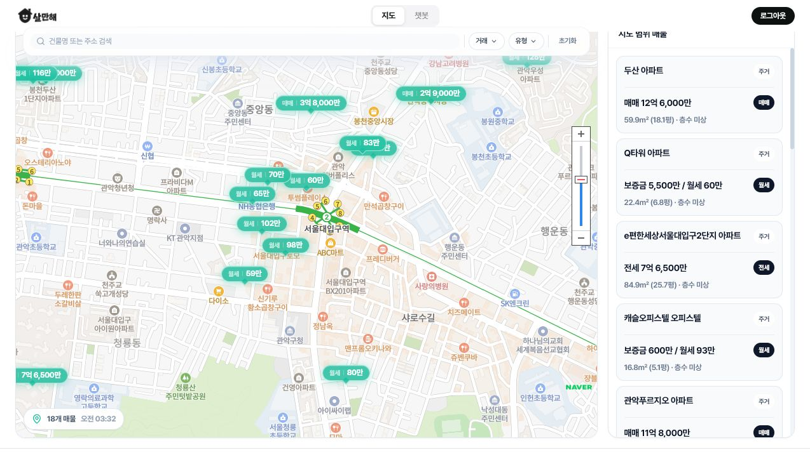
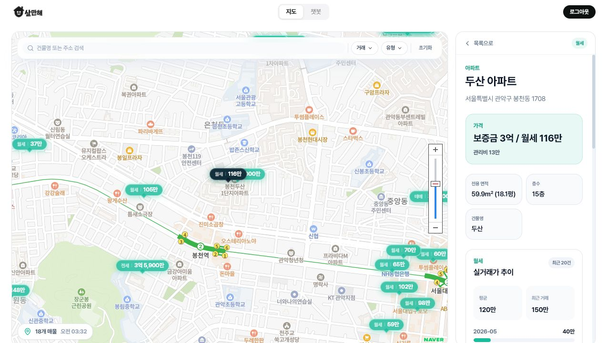
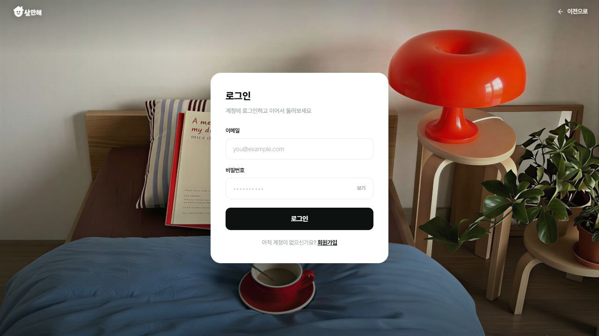
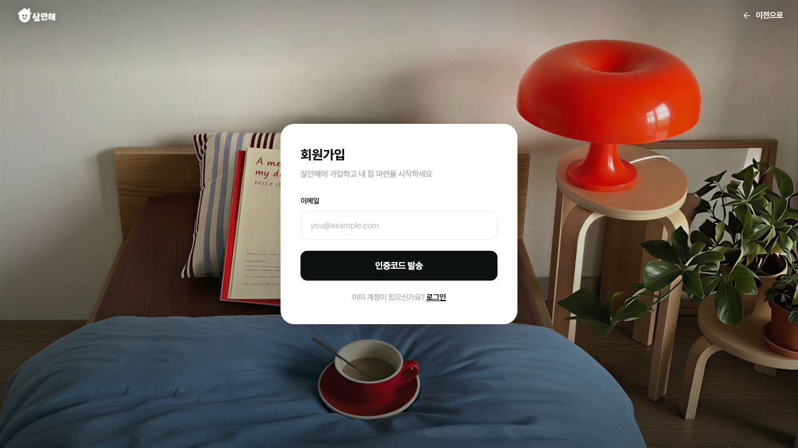
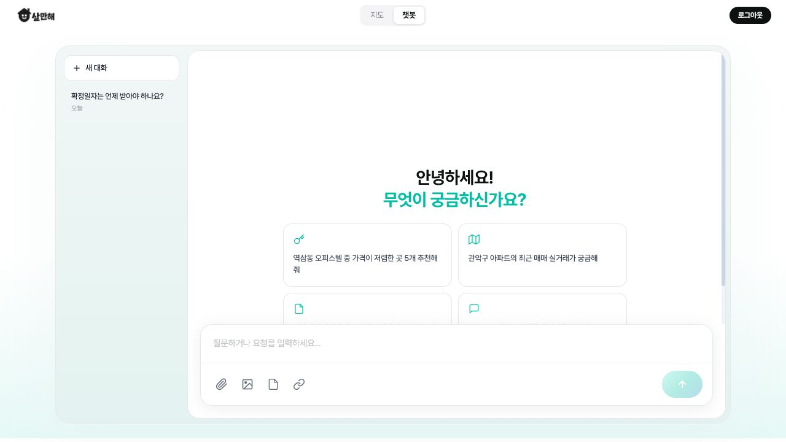
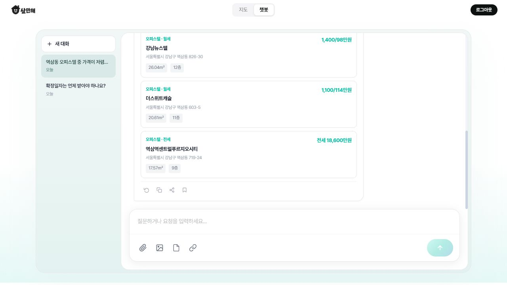
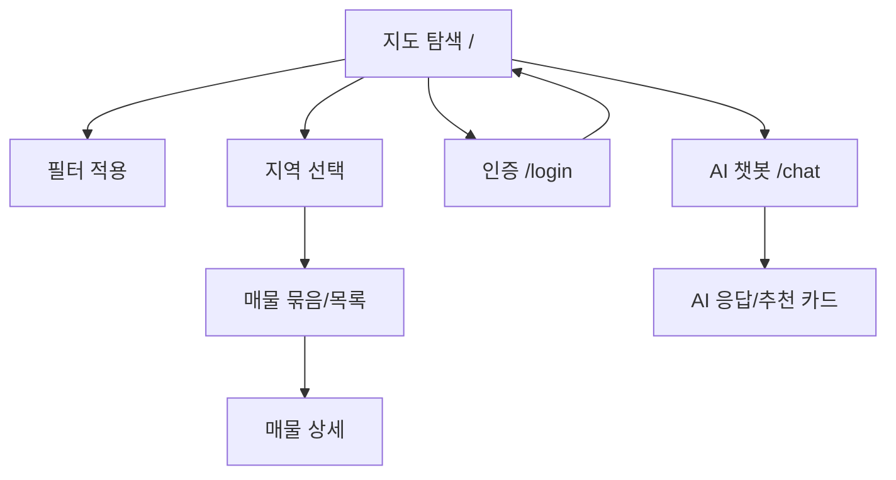

# 화면정의서

## 1. 화면 목록

| 화면 ID | Route | 화면명 | 구현 파일 | 인증 | 목적 |
| --- | --- | --- | --- | --- | --- |
| SCR-01 | `/` | 지도 탐색 | `frontend/src/views/MapExplorer.vue` | 공개 | 지도 기반 매물 탐색, 필터, 지역/묶음/개별 매물 조회 |
| SCR-02 | `/login` | 인증 | `frontend/src/views/AuthView.vue` | 공개 | 로그인, 이메일 인증 기반 회원가입 |
| SCR-03 | `/chat` | AI 챗봇 | `frontend/src/views/Chatbot.vue` | 필요 | 자연어 기반 매물 추천, 법률 상담, 시세/안전 분석 |

## 2. 공통 레이아웃

| 영역 | 내용 |
| --- | --- |
| Header | 좌측 살만해 로고, 중앙 `지도`/`챗봇` 네비게이션, 우측 로그인 또는 로그아웃 |
| Main | 선택된 라우트 화면 렌더링 |
| Footer | 지도 화면 하단 copyright 표시 |
| 인증 가드 | `/chat` 접근 시 미로그인 사용자는 인증 화면으로 이동 |

## 3. 배포 라우팅

| 접근 방식 | 결과 |
| --- | --- |
| `https://salmanhae.vercel.app/` 직접 접근 | 지도 탐색 화면 정상 표시 |
| 메인 화면에서 `로그인` 클릭 | 인증 화면 표시 |
| 메인 화면에서 `챗봇` 클릭 | 로그인 상태이면 챗봇 화면 표시, 미로그인 상태이면 인증 화면으로 이동 |
| `/login`, `/chat`, `/diagnosis`, `/recommend`, `/community` 직접 접근 | Vercel 404 화면 표시 |

배포 환경에서는 메인 화면에서 내부 네비게이션을 통해 이동하는 흐름을 사용한다.

---

## 4. SCR-01 지도 탐색

### 4.1 목적

사용자가 네이버지도 기반으로 현재 지도 범위의 지역별 매물 수, 매물 묶음, 개별 매물, 상세 가격 정보를 단계적으로 확인한다.

### 4.2 기본 화면

| 영역 | 요소 | 설명 |
| --- | --- | --- |
| 검색 | `건물명 또는 주소 검색` 입력창 | 건물명 또는 주소 키워드로 매물 검색 |
| 필터 | `거래`, `유형`, `초기화` | 거래유형과 매물유형 조건 변경 |
| 지도 | 네이버지도, 지역별 버튼 | 현재 zoom에서 지역명과 매물 수 표시 |
| 상태 | `200개 지역`, 조회 시각 | 현재 지도 범위 요약과 마지막 조회 시각 표시 |
| 우측 패널 | `지도 범위 매물` | 상세 매물은 확대 후 표시된다는 안내 또는 선택 결과 표시 |

### 4.3 필터 상태

| 필터 | 옵션 |
| --- | --- |
| 거래 | 전체, 월세, 전세, 매매 |
| 유형 | 전체, 원룸, 오피스텔, 아파트, 빌라, 다세대 |
| 초기화 | 선택한 검색/필터 조건 초기화 |

### 4.4 지역 선택 상태

| 항목 | 설명 |
| --- | --- |
| 지역 버튼 선택 | 선택한 읍/면/동의 대표 가격과 포함 매물 수 표시 |
| 대표 가격 | 선택 지역 안의 매물 가격 요약 |
| 포함 매물 | 선택 지역에 포함된 매물 개수 |
| 확대해서 보기 | 해당 지역 중심으로 확대해 매물 묶음 또는 개별 매물 상태로 전환 |

### 4.5 매물 목록 상태

| 항목 | 설명 |
| --- | --- |
| 지도 마커 | 월세, 전세, 매매 가격 단위의 개별 매물 버튼 표시 |
| 우측 목록 | 건물명, 주소, 거래유형, 가격, 면적, 층수 표시 |
| 매물 선택 | 지도 마커 또는 우측 목록 선택 시 상세 화면으로 전환 |

### 4.6 매물 상세 상태

| 항목 | 설명 |
| --- | --- |
| 기본 정보 | 거래유형, 매물유형, 건물명, 주소 |
| 가격 정보 | 보증금/월세, 전세가, 매매가, 관리비 |
| 물건 정보 | 전용 면적, 층수, 건물명 |
| 실거래가 추이 | 주변 또는 동일 건물의 최근 거래 내역과 평균/최근 거래 정보 |
| 목록 복귀 | 상세 화면에서 매물 목록으로 돌아감 |

### 4.7 연결 API

| 이벤트 | API |
| --- | --- |
| 지도 범위 조회 | `GET /api/v1/map/viewport` |
| 매물 목록 조회 | `GET /api/v1/properties` |
| 매물 상세 조회 | `GET /api/v1/properties/{propertyId}` |
| 실거래가 조회 | `GET /api/v1/properties/{propertyId}/transactions` |

---

## 5. SCR-02 인증

### 5.1 목적

사용자가 이메일과 비밀번호로 로그인하고, 신규 사용자는 이메일 인증 후 회원가입한다.

### 5.2 로그인 화면

| 영역 | 요소 | 설명 |
| --- | --- | --- |
| 상단 | 로고, `이전으로` | 메인 화면 복귀 |
| 입력 | 이메일, 비밀번호 | 계정 정보 입력 |
| 보조 기능 | 비밀번호 보기 | 비밀번호 표시 전환 |
| 제출 | 로그인 버튼 | 인증 성공 시 지도 화면으로 이동 |
| 전환 | 회원가입 링크 | 회원가입 단계로 전환 |

### 5.3 회원가입 화면

| 단계 | 입력 | 동작 |
| --- | --- | --- |
| 이메일 입력 | 이메일 | 인증코드 발송 |
| 인증코드 확인 | 이메일, 인증코드 | 이메일 인증 완료 |
| 계정 정보 입력 | 닉네임, 비밀번호 | 회원가입 완료 후 로그인 가능 |

### 5.4 연결 API

| 이벤트 | API |
| --- | --- |
| 인증 코드 발송 | `POST /api/v1/auth/email/send` |
| 인증 코드 검증 | `POST /api/v1/auth/email/verify` |
| 회원가입 | `POST /api/v1/auth/signup` |
| 로그인 | `POST /api/v1/auth/login` |
| 로그아웃 | `POST /api/v1/auth/logout` |

---

## 6. SCR-03 AI 챗봇

### 6.1 목적

로그인 사용자가 자연어로 매물 추천, 임대차 법률 질문, 시세와 안전 분석을 요청하고, AI 응답과 카드형 결과를 확인한다.

### 6.2 새 대화 화면

| 영역 | 요소 | 설명 |
| --- | --- | --- |
| 좌측 | 새 대화, 대화 목록 | 새 세션 생성과 기존 세션 전환 |
| 중앙 | 인사 문구 | `안녕하세요! 무엇이 궁금하신가요?` |
| 예시 질문 | 추천 질문 카드 | 매물 추천, 시세, 법률, 안전 관련 질문 |
| 하단 | 입력창, 첨부 아이콘, 전송 버튼 | 자연어 질문 입력 |

현재 배포 화면의 예시 질문은 다음과 같다.

| 구분 | 문구 |
| --- | --- |
| 매물 추천 | 역삼동 오피스텔 중 가격이 저렴한 곳 5개 추천해줘 |
| 시세 조회 | 관악구 아파트의 최근 매매 실거래가 궁금해 |
| 법률 상담 | 전세사기 피해지원 특별법은 어떤 경우에 도움이 되나요? |
| 안전 분석 | 성북구 돈암동은 자취하기 안전한 곳인가요? |

### 6.3 응답 화면

| 영역 | 요소 | 설명 |
| --- | --- | --- |
| 대화 목록 | 세션 제목, 생성일 | 현재 대화와 과거 대화 목록 표시 |
| 사용자 메시지 | 우측 말풍선 | 사용자가 입력한 질문 표시 |
| AI 메시지 | 좌측 말풍선 | 자연어 답변 표시 |
| 매물 카드 | 매물유형, 거래유형, 건물명, 주소, 가격, 면적, 층수 | 추천 매물 목록 표시 |
| 액션 | 다시 생성, 복사, 공유, 저장 | AI 메시지 후속 조작 |
| 입력창 | 질문 입력, 첨부 아이콘, 전송 버튼 | 추가 질문 전송 |

### 6.4 응답 데이터 표시

| 응답 필드 | 화면 표시 |
| --- | --- |
| `message` | AI 답변 본문 |
| `properties` | 추천 매물 카드 |
| `legalCards` | 법률 근거 카드 |
| `analysisCards` | 시세/안전 분석 카드 |

### 6.5 연결 API

| 이벤트 | API |
| --- | --- |
| 메시지 전송 | `POST /api/v1/chat` |

---

## 7. 화면 흐름

