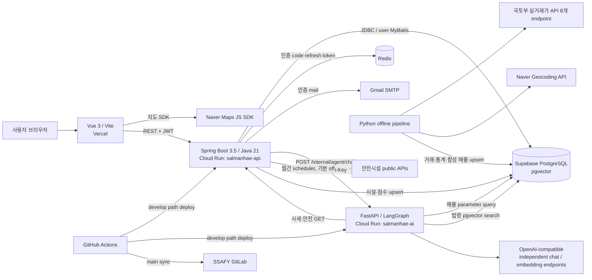

# 사실 기반 프로젝트 개요

## 1. 한 줄 정의

청년 1인 가구가 계약 전에 **실거래가 기반 합성 매물, 주변 안전시설, 시세, 임대차 법령**을 지도와 자연어 질문으로 함께 확인할 수 있도록 만든 AI 기반 부동산 탐색 서비스다.

현재 제품을 “실매물 중개 서비스”나 “HUG 정밀 판정 서비스”로 소개하면 안 된다. F-1 매물은 실제 실거래가 건물 anchor와 가격 범위를 바탕으로 생성한 `MVP_SYNTHETIC` 데이터이며, 핵심은 탐색·분석 흐름 검증이다.

## 2. 프로젝트 목적과 대상 사용자

### 해결하려는 문제

- 청년 1인 가구가 실거래가, 안전시설, 임대차 법령을 여러 서비스에서 따로 찾아야 한다.
- 법령 원문과 계약 안전 정보를 비전문가가 해석하기 어렵다.
- 외부 공공 API를 사용자 요청마다 호출하면 속도·호출 한도·응답 형식 변화에 취약하다.

### 대상 사용자

- 전월세·매매 계약 전 매물과 지역 정보를 비교하려는 사용자
- 임대차 관련 법령 근거를 함께 확인하려는 사용자
- 지도 탐색은 비로그인으로, AI 채팅은 로그인 후 사용하려는 사용자

근거: [`docs/01_PRD.md`](../docs/01_PRD.md), [`artifact/01. 요구사항정의서.pdf`](<../artifact/01. 요구사항정의서.pdf>).

## 3. 기간과 팀

| 항목 | 확인 결과 |
|---|---|
| 발표자료상 개발 기간 | 2026.05~2026.06 |
| 현재 Git에 남은 구현 기간 | 2026-06-12~2026-06-26 |
| 팀 구성 | 2명: 김용휘, 이다인 |
| 본인 | 김용휘 (`HOKAGO-MEMORIES`) |
| 본인 역할 근거 | 발표자료: 법률 RAG·CI/CD 회고, GitHub: 관련 PR·commit author |

팀원 이다인(`crolvlee`)이 주도한 것으로 확인되는 대표 영역은 Spring Security 인증, Supervisor 패턴 전환, 인증·채팅 세션 UI, 최종 UI 디자인이다. 김용휘의 포트폴리오에서는 이를 본인 구현으로 표현하지 않는다.

## 4. 현재 핵심 기능과 구현 상태

| 기능 | 상태 | 현재 구현 근거·제한 |
|---|---|---|
| 지도 기반 매물 탐색 | 구현됨 | bounds/zoom별 지역·cluster·개별 매물, 상세, 실거래가 추이 |
| 실거래가 데이터 bootstrap | 8 endpoint 코드 구현, 전체 실행 확인 필요 | 국토부 8개 endpoint 설정·공통 정규화·지오코딩·통계·합성 매물·충돌 키 upsert. 커밋된 8,121건은 4개 source만 확인됨 |
| AI 매물 추천 | 일부 구현 | 자연어 조건 JSON 추출 후 허용 필드 기반 parameter SQL, 결과 카드 |
| 법률 RAG | 코드 구현, 데이터 적재 확인 필요 | 청킹·hash·embedding·pgvector 검색·근거 카드·prompt-level grounding 답변 |
| 시세 분석 | 구현됨 | 선택 매물 Spring API, 지역 질의 `region_price_stat` 조회 |
| 안전 분석 | 백엔드 중심 구현 | 안전시설 수집, 점수 사전 계산, Spring summary, AI 카드 |
| 이메일/JWT 인증 | 코드 구현, 운영 users migration 확인 필요 | Gmail·Redis·BCrypt·access/refresh rotation·JWT filter |
| 대화 세션 | 프론트 로컬만 | `localStorage`, 서버 영속화 없음 |
| HUG 계산 | UI prototype만 | 프론트 계산식만 있고 공식 API·백엔드 판정 없음 |
| 찜하기 | 계획만 존재 | table/controller/service/frontend API 없음 |
| 커뮤니티·가중치 추천 | 잔존 mock/비핵심 | route 파일은 있으나 현재 store 계약과 맞지 않아 완성 기능으로 보기 어려움 |

“구현됨”은 코드와 테스트가 존재한다는 뜻이다. 운영 DB에 데이터가 들어 있고 실제 배포 환경에서 전 시나리오가 성공했다는 뜻은 아니다.

## 5. 실제 기술 스택

| 영역 | 기술 | 실제 사용 목적 |
|---|---|---|
| Frontend | Vue 3, Vite, Vue Router, Pinia | 지도·인증·채팅 UI와 feature 상태 관리 |
| HTTP | Axios | Spring REST 호출, JWT 첨부, 401 refresh single-flight |
| Styling | Tailwind CSS, Lucide Vue | UI styling·icon |
| Map | Naver Maps JavaScript SDK | script 동적 로드, marker·center·zoom 처리 |
| Backend | Java 21, Spring Boot 3.5, Spring MVC | 공개 REST API와 핵심 domain service |
| Security | Spring Security, JJWT, BCrypt | stateless JWT 인증·인가와 password hash |
| Cache/session | Redis | email code, 인증 완료 flag, refresh token TTL 저장 |
| Mail | Gmail SMTP | 회원가입 이메일 인증 code 발송 |
| DB access | NamedParameterJdbcTemplate, 일부 MyBatis | 매물·시세·안전은 JDBC, user는 MyBatis mapper |
| AI Backend | Python 3.12, FastAPI, LangGraph | 내부 AI API와 Supervisor·worker orchestration |
| AI I/O | httpx 기반 OpenAI-compatible API | chat과 embedding endpoint·key·model을 각각 독립 설정해 호출; 실제 embedding provider/model은 미확인 |
| Database | Supabase PostgreSQL | 매물·실거래가·통계·안전시설·법률 chunk 저장 |
| Vector search | pgvector SQL (`<=>`) | 법령 embedding cosine 유사도 검색 |
| Test | JUnit/MockMvc/Mockito/H2, pytest, Node `--test` | 계층·계약·fallback·parser·store/util 회귀 검증 |
| Infra | Docker, Cloud Run, Vercel, GitHub Actions | Spring/FastAPI 독립 배포, frontend 배포, GitLab sync |

### README를 그대로 복사하면 틀리는 항목

- Backend DB: README의 MySQL과 달리 실제 설정·driver·migration은 PostgreSQL이다.
- AI Python: 일부 지침·발표자료의 3.11과 달리 현재 `pyproject.toml`과 Dockerfile은 3.12다.
- LLM: ADR의 Claude 표현과 달리 현재 코드는 특정 SDK 없이 OpenAI-compatible HTTP endpoint를 쓴다.
- MyBatis: 전체 domain이 아니라 user mapper에만 쓰며, 주요 조회는 JDBC다.
- Spring Batch: 의존성·job은 없고 Spring `@Scheduled` 두 개만 있다.
- Text-to-SQL: 임의 SQL 생성이 아니라 자연어를 제한된 조건 JSON으로 바꿔 parameter query를 조립한다.

## 6. 모듈 구성

### Frontend

- [`frontend/src/views/MapExplorer.vue`](../frontend/src/views/MapExplorer.vue): 지도, 필터, marker, 목록·상세 panel
- [`frontend/src/views/Chatbot.vue`](../frontend/src/views/Chatbot.vue): AI 답변과 매물·법률·분석 카드
- [`frontend/src/views/AuthView.vue`](../frontend/src/views/AuthView.vue): 이메일 인증·회원가입·로그인
- [`frontend/src/store/mapStore.js`](../frontend/src/store/mapStore.js): bounds, zoom, filter, viewport, 선택 매물 상태
- [`frontend/src/store/chatSessionStore.js`](../frontend/src/store/chatSessionStore.js): 브라우저 대화 세션
- [`frontend/src/api/http.js`](../frontend/src/api/http.js): 공통 HTTP와 refresh queue

### Spring Backend

- 인증: `AuthController → AuthService`, `JwtAuthenticationFilter`
- 매물·지도: `PropertyController`, `MapViewportController`, service, `JdbcPropertyDao`
- 시세: `PriceAnalysisController`
- 안전: 시설 조회·수집 service, 두 scheduler, 점수 service
- 채팅: `ChatController → ChatServiceImpl → AiAgentClient`

Controller는 validation과 위임에 집중하고, 비즈니스 로직은 service에 둔 구조가 대체로 확인된다.

### AI Backend

- [`backend-ai/app/api/routes.py`](../backend-ai/app/api/routes.py): `/health`, `/internal/agent/chat`
- [`backend-ai/app/graph/builder.py`](../backend-ai/app/graph/builder.py): Supervisor 순환 graph
- `graph/nodes`: 매물·법률·시세·안전·일반대화 worker와 answer node
- `clients`: LLM, embedding, Spring internal HTTP, PostgreSQL
- `rag`: 법령 chunk·retriever·prompt

### Data·Infra

- [`scripts/data_pipeline/pipeline.py`](../scripts/data_pipeline/pipeline.py): 국토부 8개 endpoint 대응 offline pipeline
- [`database/migrations`](../database/migrations): PostgreSQL·pgvector schema
- [`.github/workflows`](../.github/workflows): 두 Cloud Run deploy와 GitLab sync
- `phases/`: Codex/Claude Harness 지시서·status로 런타임 module은 아님

## 7. 현재 구현 기준 아키텍처



## 8. 주요 요청 흐름

### 지도 탐색

```text
브라우저 bounds·zoom·filter
→ GET /api/v1/map/viewport
→ MapViewportService가 zoom별 mode 결정
→ JdbcPropertyDao가 지역 집계 / grid cluster / 개별 매물 SQL
→ marker 렌더링
→ 매물 선택 시 상세 + 최근 거래를 병렬 조회
```

현재 zoom 기준은 `<=9 SIDO`, `10~11 SIGUNGU`, `12~13 DONG`, `14~15 CLUSTER`, `>=16 PROPERTY`다. 넓은 zoom의 값은 현재 활성 매물 가격 집계이며 “실거래가 평균”이라고 단정하면 안 된다.

### 인증

```text
이메일 code 발급 → Redis 5분 → Gmail 발송
→ code 검증 → Redis 인증 flag 10분
→ 회원가입 BCrypt hash
→ 로그인 access 15분 + refresh 7일
→ refresh Redis 저장/rotation
→ Axios가 access 첨부, 401 시 single-flight refresh
```

인증 core는 팀원 `crolvlee`가 구현한 것으로 Git 이력이 확인된다.

### AI 채팅

```text
Frontend POST /api/v1/chat
→ Spring JWT filter
→ ChatService / AiAgentClient
→ FastAPI /internal/agent/chat
→ Supervisor가 worker 선택·반복
→ 매물 / 법률 / 시세 / 안전 / 일반대화 worker
→ generate_answer
→ Spring → Frontend cards
```

현재 중요한 계약 drift가 있다. FastAPI와 API 문서는 `workersCalled`를 반환하지만 Spring `AiAgentClient`·`ChatResponse`와 frontend normalizer는 아직 `intent`를 기대한다. 따라서 `workersCalled`는 end-to-end에서 소실된다. 이는 구현 완료 기능이 아니라 개선 필요 사항이다.

## 9. 데이터 흐름

### 실거래가·합성 매물

```text
국토부 XML 8개 endpoint 설정
→ 공통 transaction_history
→ building_key anchor
→ Naver geocoding
→ region/building price stat
→ MVP_SYNTHETIC property 1~2개
→ Supabase 충돌 키 기반 upsert
```

현재는 Python offline pipeline이며 국토부 일일 Spring Scheduler는 없다. manifest에 기록되고 비어 있지 않은 raw XML page는 다음 실행에서 재사용하지만 API `resultCode`를 별도 검사하지 않아 이를 성공 checkpoint로 볼 수는 없다. 자동 retry/backoff도 없다. 8개 endpoint 설정·alias 경로 가운데 저장소 raw/seed로 실제 호환성이 확인되는 것은 아파트·오피스텔 전월세·매매 4개 source다.

### 안전시설·시설 접근성 점수

```text
CCTV JSON / 비상벨 JSON / 보안등 JSON / 선택적 Safemap XML
→ 공통 NormalizedSafetyFacility
→ safety_facility upsert
→ bounds 후보 조회 + Java Haversine
→ 300m/500m count와 30/25/25/20 규칙 기반 시설 접근성 점수
→ property_score_stat upsert
```

사용자 요청 시 public API를 부르지 않고 저장된 값을 읽는다. 이 값은 범죄 발생 가능성을 계산한 공인 안전도가 아니라 주변 시설 접근성 proxy다. 네 source client는 구현됐지만 모두의 운영 수집 성공은 확인되지 않았다. scheduler 두 개는 기본 비활성이고 Cloud Run scale-to-zero/다중 instance에서 정시·단일 실행 보장이 없다는 운영 한계가 남아 있다.

## 10. 데이터베이스 구현 범위

운영 migration으로 확인되는 table:

- `transaction_history`
- `properties`
- `region_price_stat`
- `building_price_stat`
- `legal_document_chunks`
- `property_score_stat`
- `safety_facility`

`users`는 test schema와 mapper에서만 보이고 운영 migration이 없다. `wishlist`, `conversation_session`, `conversation_message` migration도 없다. 따라서 문서의 전체 domain model과 재현 가능한 현재 schema는 다르다.

## 11. 배포·CI/CD

- `develop`에서 `backend/**` 변경 시 Spring Cloud Run 배포
- `develop`에서 `backend-ai/**` 변경 시 FastAPI Cloud Run 배포
- frontend는 Vercel Git integration
- `main` push 시 monorepo와 artifact subtree를 SSAFY GitLab로 동기화

GitHub 이력에는 Spring 16회, FastAPI 9회, GitLab sync 8회의 성공 Actions run이 있다. Vercel 최신 production deployment도 success다.

다만 deploy workflow에 test·lint step이 없고 Spring Docker build는 `-DskipTests`다. “CI/CD를 구축했다”는 표현은 가능하지만 “테스트 실패를 자동 차단했다”는 표현은 근거가 없다.

## 12. 계획과 실제 구현의 차이

| 문서·발표 주장 | 현재 코드 판정 |
|---|---|
| 전체 MVP 완료 | 지도·AI·안전 core는 있으나 wishlist, server session, users migration 등 미완성 |
| Python 3.11 | 현재 3.12 |
| Claude API | generic OpenAI-compatible HTTP |
| 전 domain MyBatis | user만 MyBatis, 주요 domain은 JDBC |
| Text-to-SQL | 허용 조건 기반 parameter SQL |
| 줌별 실거래가 평균 | 현재 viewport region은 활성 매물 가격 집계 |
| 국토부 매일 Spring batch | offline Python pipeline만 구현 |
| PostGIS 반경 query | bounds prefilter + Java Haversine |
| 찜·대화 DB | migration·backend 구현 없음 |
| `workersCalled` end-to-end | FastAPI 이후 Spring/FE에서 소실 |

## 13. 현재 한계와 개선 우선순위

1. `workersCalled`를 Spring·Frontend까지 전달하고 consumer contract test를 추가한다.
2. 운영 migration에 `users`를 추가해 인증 환경을 재현 가능하게 한다.
3. test→build→deploy CI gate를 추가한다.
4. `@Scheduled`를 Cloud Scheduler/Run Job 또는 분산 lock 구조로 옮긴다.
5. 국토부 데이터 정기 갱신 job을 운영화한다.
6. frontend 안전시설 layer와 safety summary를 연결한다.
7. F-7·F-8·HUG mock을 “계획/프로토타입”으로 명확히 격리한다.
8. JWT access/refresh type 구분, localStorage XSS trade-off, 공통 인증 error JSON을 보완한다.

세부 질문은 [`07-open-questions.md`](07-open-questions.md)에 기록한다.
