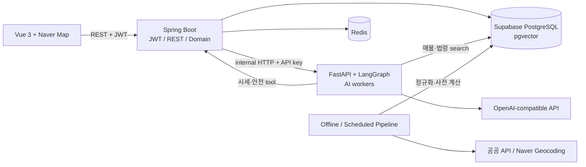

# 살만해

## 한 줄 소개

실거래가 기반 합성 매물, 주변 안전시설, 시세, 임대차 법령 근거를 지도와 AI worker로 연결해 청년 1인 가구의 계약 전 정보 탐색을 돕는 서비스입니다.

## 프로젝트 개요

| 항목 | 내용 |
|---|---|
| 개발 기간 | 2026.05~2026.06 (발표자료 기준), Git 구현 이력 2026.06.12~06.26 |
| 팀 구성 | 2명: 김용휘, 이다인 |
| 담당 역할 | 실거래가·안전시설 data/backend, 지도 API, 법률 RAG, Spring-FastAPI 분석 연동, 배포 자동화 |
| 대상 사용자 | 계약 전 매물 가격·안전·법령 정보를 함께 확인하려는 청년 1인 가구 |
| 프로젝트 목적 | 흩어진 공공데이터와 법령 정보를 지도·자연어 질문 한 흐름으로 연결 |
| GitHub | [ssafy-salman/salmanhae](https://github.com/ssafy-salman/salmanhae) |
| 배포 근거 | Vercel deployment, Spring·FastAPI Cloud Run Actions, GitLab sync 성공 기록 |

현재 매물은 실시간 중개 매물이 아니라 국토교통부 실거래가의 실제 건물·가격 범위를 기반으로 생성한 `MVP_SYNTHETIC` data입니다. 실제 매물 중개, 찜하기, server-side 대화 memory, HUG 정밀 판정은 완성 기능으로 소개하지 않습니다.

## 기술 스택

| 기술 | 실제 사용 목적 |
|---|---|
| Java 21, Spring Boot 3.5 | 매물·지도·시세·안전 REST API와 chat proxy 구현 |
| Spring Security, JJWT | 팀원이 구현한 stateless JWT 인증·인가; 인증된 chat 경계에 사용 |
| NamedParameterJdbcTemplate, MyBatis | 매물·통계·안전 parameter query, user mapper |
| PostgreSQL, Supabase | 거래·합성 매물·통계·안전시설·법령 chunk 저장 |
| Python 3.12, FastAPI | AI 기능을 Spring과 독립된 내부 service로 운영 |
| LangGraph | 팀원이 구현한 Supervisor가 여러 worker를 순차 조합 |
| pgvector | 법령 embedding cosine similarity search |
| OpenAI-compatible API | chat과 embedding endpoint·key·model을 각각 독립 설정해 호출; 실제 embedding provider/model은 미확인 |
| Vue 3, Vite, Pinia, Axios | Naver map·인증·chat UI와 state/API layer |
| Redis, Gmail SMTP | 이메일 code와 refresh token TTL 저장·발송 |
| Docker, Cloud Run, Vercel, GitHub Actions | 두 backend 독립 배포, frontend 배포, GitLab 제출 sync |

`Text-to-SQL`이라고 표현하기보다 “자연어를 허용된 조건 JSON으로 추출하고 parameter SQL을 조립했다”고 설명하는 것이 실제 구현에 맞습니다.

## 서비스 아키텍처

- Frontend는 Spring REST만 직접 호출합니다.
- Spring은 인증과 domain API를 담당하고 FastAPI에 chat을 위임합니다.
- FastAPI는 매물 검색, 법률 RAG, 시세·안전 worker 결과를 모아 답변을 생성합니다.
- public API data는 request-time에 호출하지 않고 미리 DB에 저장합니다.

## 주요 담당 업무

### 1. 국토부 8개 endpoint를 재실행 가능한 data pipeline으로 구성

- **담당**: 거래·매물 schema, XML 정규화, Naver geocoding, 지역·건물 통계, 합성 매물, Supabase upsert.
- **필요성**: 실제 중개 매물이 없는 MVP에서도 임의 좌표·가격이 아닌 실제 거래 anchor로 지도 흐름을 검증해야 했습니다.
- **구현**: 8개 endpoint를 설정하고 alias 기반 공통 `transaction_history` 경로와 `building_key`를 만들었으며, `source_api + source_transaction_key` unique key와 conflict upsert로 단순 중복 삽입을 방지했습니다. 실제 raw 호환성은 4개 source만 확인됩니다.
- **결과**: Git diff에서 초기 거래 8,121건·매물 300건 artifact를 확인했고 PR #8에는 DB 반영 성공 보고가 있습니다. 거래 artifact는 아파트·오피스텔 전월세·매매 4개 source입니다. 이후 commit된 대용량 seed를 제거해 지역·기간·8 endpoint를 parameter로 받는 plan/run/load/verify pipeline으로 전환했으며 전체 범위 실행은 확인되지 않았습니다.
- **근거**: [PR #8](https://github.com/ssafy-salman/salmanhae/pull/8), [PR #33](https://github.com/ssafy-salman/salmanhae/pull/33).

### 2. 지도 zoom별 query와 검색 filter를 backend contract로 통일

- **담당**: region/cluster/property mode API, grid aggregate SQL, frontend marker, keyword/filter 공통화.
- **필요성**: 넓은 zoom에서 개별 매물을 모두 표시하기 어려웠고, 프론트 로컬 목록에만 적용된 keyword가 지역 marker·viewport request에는 전달되지 않았습니다.
- **구현**: zoom별 response type을 server에서 결정하고, 기존 가격·유형 DAO filter builder에 keyword와 public bounds list를 정렬했습니다. SQL wildcard와 frontend whitespace도 review 후 보정했습니다.
- **결과**: 당시 서버가 지원한 단일 거래유형·매물유형·보증금·매매가·keyword는 목록·aggregate가 같은 조건을 사용합니다. 현재 최종 UI의 월세 범위·복수 거래유형과 Spring 계약은 다시 정렬이 필요합니다.
- **근거**: [PR #54](https://github.com/ssafy-salman/salmanhae/pull/54)~[#67](https://github.com/ssafy-salman/salmanhae/pull/67), [PR #95](https://github.com/ssafy-salman/salmanhae/pull/95).

### 3. 법률 RAG의 ingestion부터 검색 근거 제한 answer까지 구현

- **담당**: 법령 schema·chunk·hash·embedding·pgvector retrieval·answer·frontend card 초기 연결.
- **필요성**: 임대차 질문에 법령 근거 없이 일반 답변을 생성하거나 고정 template만 반환하면 사용자가 근거를 확인할 수 없습니다.
- **구현**: `content_hash` 기반 conflict upsert, top-k vector search, retrieved law/article만 사용하도록 지시하는 prompt, 근거 없음 fallback을 구성했습니다. non-prod에서 `psycopg.OperationalError`가 나면 HTTPS REST+local cosine fallback을 사용하되 production에서는 같은 오류를 숨기지 않았습니다.
- **결과**: stub을 실제 retrieval과 live OpenAI-compatible answer 경로로 교체했고, 외부 network 없이도 fake client로 회귀 검증할 수 있게 했습니다. 운영 법령 row와 답변 품질은 확인되지 않았으며 환각 방지를 보장하지 않습니다.
- **근거**: [PR #17](https://github.com/ssafy-salman/salmanhae/pull/17)~[#35](https://github.com/ssafy-salman/salmanhae/pull/35).

### 4. 서로 다른 안전시설 API를 통합하고 시설 접근성 점수를 사전 계산

- **담당**: CCTV·비상벨·보안등·치안시설 parser/client, 수집 batch, Haversine score, 403·401 기록에 대한 대응 코드.
- **필요성**: provider마다 JSON/XML, 이전 CSV 경로, field, page limit, service key, 좌표계가 달랐고 request-time 호출은 느리고 불안정했습니다.
- **구현**: 공통 normalized model, 상위 source 예외 격리, Web Mercator→WGS84, page cap, key encoding을 적용했습니다. 시설을 DB에 저장한 뒤 300m/500m count와 30/25/25/20 규칙 기반 시설 접근성 score를 batch에서 계산했습니다.
- **결과**: HTTP 403을 반환한 CCTV CSV 경로를 JSON OpenAPI로 교체하고, 401 기록 뒤 key encoding과 Safemap opt-in을 보강했습니다. 네 source의 수정 후 live 성공은 확인되지 않았습니다. API·AI는 저장된 score를 읽습니다.
- **근거**: [PR #69](https://github.com/ssafy-salman/salmanhae/pull/69)~[#93](https://github.com/ssafy-salman/salmanhae/pull/93).

### 5. Spring-FastAPI contract와 배포 경계 구성

- **담당**: `selectedPropertyId`·`analysisCards`, Spring 시세/안전 API, FastAPI SpringClient, 저장 수치 제한 answer, 초기 frontend card, Docker·Cloud Run Actions, GitLab sync.
- **필요성**: AI analysis가 stub이었고 두 runtime의 data·failure contract와 배포 경계가 없었습니다.
- **구현**: contract test를 먼저 작성하고 success·미선택·API failure를 구조화했습니다. module path별 Cloud Run deploy와 `main`→GitLab monorepo/artifact sync를 만들었습니다.
- **결과**: GitHub 이력에서 Spring 16회, FastAPI 9회, GitLab sync 8회 성공을 확인했습니다. 단, deploy workflow에 test gate가 없다는 한계가 있습니다.
- **근거**: [PR #37](https://github.com/ssafy-salman/salmanhae/pull/37)~[#50](https://github.com/ssafy-salman/salmanhae/pull/50), [PR #52](https://github.com/ssafy-salman/salmanhae/pull/52), [`2a81344`](https://github.com/ssafy-salman/salmanhae/commit/2a81344328900226045f3090474392f15d8c1d5f).

## 핵심 문제 해결 경험

### 1. public 안전 data가 local fixture와 다르게 실패한 문제

- **문제**: CCTV CSV 403, JSON 401, Safemap key error, 보안등 Web Mercator와 `body[]` shape.
- **원인**: provider별 delivery·key·coordinate·pagination contract 차이. 403의 제공자 내부 원인과 401의 단일 원인은 확정하지 못했습니다.
- **해결**: CCTV JSON OpenAPI 전환, source-specific parser, key encode, page cap, Safemap opt-in, source failure isolation.
- **결과**: 상위로 전달된 source 예외가 전체 batch를 막지 않고 공통 `safety_facility`에 저장 가능한 구조가 됐습니다. 다만 일부 client가 오류를 빈 결과로 바꿔 실패를 놓칠 수 있습니다.
- **배운 점**: 외부 API client는 정상 response뿐 아니라 인증 문자, 좌표계, 부분 실패, 운영 smoke 범위를 함께 설계해야 합니다.

### 2. 법률 RAG가 template answer처럼 보이고 local DB port가 막힌 문제

- **문제**: retrieved card가 있어도 고정 답변이 나오고, PostgreSQL port 차단으로 retrieval 검증이 중단됐습니다.
- **원인**: live LLM·real vector client 연결이 뒤 phase였고 개발 network와 운영 failure policy가 구분되지 않았습니다.
- **해결**: OpenAI-compatible live call과 deterministic fallback, non-prod REST+local cosine, production error propagation, retrieval 결과가 prompt·card에 전달되는 test.
- **결과**: 실제 RAG 코드 경로와 network-independent test 경계를 동시에 확보했습니다. 운영 데이터와 답변 정확도는 별도 검증이 필요합니다.
- **배운 점**: fallback은 장애를 숨기는 장치가 아니라 환경별 failure semantics를 명시하는 설계입니다.

### 3. 지도 검색 결과와 지역 marker가 서로 달랐던 문제

- **문제**: keyword는 현재 상세 매물 배열만 local filter했고 지역·cluster viewport에는 전달되지 않았습니다.
- **원인**: keyword가 frontend local state에 머물렀고, PR 첫 구현의 raw keyword·SQL wildcard 문제는 review에서 추가 발견됐습니다.
- **해결**: 기존 criteria·DAO filter builder에 keyword와 public list를 정렬하고, matching count marker·trim·`%/_` literal escape와 cross-layer tests를 추가했습니다.
- **결과**: 당시 지원 필터에서는 목록과 aggregate가 같은 검색 상태를 표현하고 no-result marker도 일치하게 됐습니다. 후속 UI의 월세 범위·복수 거래유형 drift는 남아 있습니다.
- **배운 점**: 검색 contract는 endpoint 하나가 아니라 list·aggregate·UI state가 공유해야 합니다.

## 협업 경험

- GitHub monorepo에서 phase별 Issue→branch→PR→merge commit 흐름을 사용했습니다.
- 제가 맡은 초기 분석 연동 phase에서는 Spring DTO, FastAPI schema, frontend normalizer, `docs/08_API_SPEC.md`를 함께 맞췄습니다. 이후 PR #63의 응답 변경은 consumer까지 이어지지 않았습니다.
- GitHub를 개발 source로 두고 `main`을 SSAFY GitLab monorepo와 artifact project에 자동 동기화했습니다.
- 팀원 이다인은 인증 core와 Supervisor 전환, 인증·chat session UI를 주도했습니다. 저는 법률 RAG·analysis worker·data·지도·안전·deploy 경계를 담당했습니다.
- PR #63의 Supervisor 전환 후 `intent`→`workersCalled` consumer drift가 남았습니다. 이 경험을 통해 producer test뿐 아니라 Spring·frontend consumer contract test가 필요하다는 개선점을 확인했습니다.
- 사람 review·승인 기록은 없고 CodeRabbit/Vercel bot 기록만 확인됩니다. 따라서 “활발한 상호 코드 리뷰”를 성과로 쓰지 않습니다.

## 결과 및 성과

- 초기 실거래가 bootstrap의 Git artifact로 거래 8,121건과 합성 매물 300건을 확인했고 PR #8에는 DB 반영 보고가 있습니다. 실제 DB 반영과 현재 운영 row 수는 독립 확인되지 않았습니다.
- 국토부 8개 endpoint와 4종 안전시설 client를 공통 domain으로 변환하는 code path를 만들었습니다. 실제 seed로 확인되는 거래 source는 4개이며 안전시설 4종 live 성공은 미확인입니다.
- 법률 RAG, 시세·안전 분석, 지도 viewport를 각각 contract·test·초기 UI까지 연결했습니다. 최종 챗봇 UI는 팀원 후속 기여입니다.
- 저장된 38-case 평가에서 팀원의 Supervisor 전환은 복합 의도 평균 recall을 40.6%에서 94.8%로 높였고, 평균 latency는 1.54초에서 7.00초로 늘었습니다. 이는 팀 결과이며 제 개인 구현 성과로 표현하지 않습니다.
- GitHub 기록 기준 Cloud Run·Vercel·GitLab sync 자동화가 실제 성공했습니다.

## 프로젝트를 통해 배운 점

첫째, 외부 API 연동은 provider response를 DTO로 옮기는 작업이 아니라 인증, 좌표계, pagination, 재시도 정책의 유무, 부분 실패, 중복 처리 범위를 포함하는 boundary 설계입니다.

둘째, AI 기능도 일반 backend와 마찬가지로 data contract와 failure policy가 중요합니다. RAG에서는 prompt보다 ingestion·retrieval·근거 제한이, multi-service 연동에서는 producer·consumer contract test가 핵심이었습니다.

셋째, batch와 request path를 분리하면 사용자 요청을 stored-data read로 단순화할 수 있지만, scheduler의 정시·단일 실행 보장까지 설계해야 운영 가능한 system이 됩니다.

## 아쉬운 점과 개선 방향

1. FastAPI의 `workersCalled`를 Spring·frontend까지 전달하고 schema compatibility test를 추가하겠습니다.
2. 운영 migration에 `users`를 포함해 새 DB에서도 인증을 재현 가능하게 만들겠습니다.
3. GitHub Actions에 backend·AI·frontend test와 build gate를 넣은 뒤 deploy하도록 바꾸겠습니다.
4. Cloud Run API process 내부 `@Scheduled`를 Cloud Scheduler/Run Job으로 분리해 scale-to-zero와 중복 실행 문제를 없애겠습니다.
5. 국토부 offline pipeline을 운영 증분 job으로 전환하고 row count·latency·failure rate를 측정하겠습니다.
6. HUG·community·wishlist·server session을 구현 완료처럼 보이게 하는 잔존 UI·문서를 정리하겠습니다.
7. JWT access/refresh type 구분, localStorage XSS trade-off, internal FastAPI IAM 호출을 보강하겠습니다.

## 근거 자료

### 핵심 PR

- Data: [#8](https://github.com/ssafy-salman/salmanhae/pull/8), [#33](https://github.com/ssafy-salman/salmanhae/pull/33)
- Property/Map: [#10](https://github.com/ssafy-salman/salmanhae/pull/10), [#12](https://github.com/ssafy-salman/salmanhae/pull/12), [#54](https://github.com/ssafy-salman/salmanhae/pull/54)~[#67](https://github.com/ssafy-salman/salmanhae/pull/67), [#95](https://github.com/ssafy-salman/salmanhae/pull/95)
- Legal RAG: [#17](https://github.com/ssafy-salman/salmanhae/pull/17)~[#35](https://github.com/ssafy-salman/salmanhae/pull/35)
- Analysis: [#37](https://github.com/ssafy-salman/salmanhae/pull/37)~[#50](https://github.com/ssafy-salman/salmanhae/pull/50)
- Safety: [#69](https://github.com/ssafy-salman/salmanhae/pull/69)~[#93](https://github.com/ssafy-salman/salmanhae/pull/93)
- Infra: [#52](https://github.com/ssafy-salman/salmanhae/pull/52)

### 핵심 현재 파일

- [`scripts/data_pipeline/pipeline.py`](../scripts/data_pipeline/pipeline.py)
- [`backend/src/main/java/com/ssafy/salmanhae/model/dao/property/JdbcPropertyDao.java`](../backend/src/main/java/com/ssafy/salmanhae/model/dao/property/JdbcPropertyDao.java)
- [`backend/src/main/java/com/ssafy/salmanhae/service/safety/PropertySafetyScoreServiceImpl.java`](../backend/src/main/java/com/ssafy/salmanhae/service/safety/PropertySafetyScoreServiceImpl.java)
- [`backend-ai/app/clients/supabase_client.py`](../backend-ai/app/clients/supabase_client.py)
- [`backend-ai/app/rag/retriever.py`](../backend-ai/app/rag/retriever.py)
- [`backend-ai/app/graph/builder.py`](../backend-ai/app/graph/builder.py)
- [`.github/workflows`](../.github/workflows)
