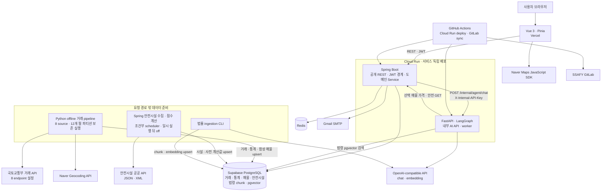

# 살만해

## 한 줄 소개

청년 1인 가구가 집을 고를 때 흩어진 거래 정보, 주변 안전시설, 임대차 법령을 지도와 자연어 질문 안에서 함께 비교하도록 만든 부동산 탐색 서비스입니다.

## 프로젝트 개요

| 항목 | 내용 |
|---|---|
| 개발 기간 | 최종 MVP 기획·개발 기간은 발표자료와 사용자 직접 답변이 함께 가리키는 **2026.05–2026.06**입니다. 현재 Git으로 직접 검증되는 구현 이력은 **2026.06.12–2026.06.26**이며, 이전 GitLab 이력 소실 경위는 사용자 진술로만 구분합니다. |
| 팀 인원 | 2명 |
| 내 역할 | 계층별 전담이 아니라 기능 단위로 나눠 개발했으며, 사용자 답변상 **F-1 지도 탐색, F-3 법률 RAG, F-4 시세·안전 분석의 핵심 구현**을 맡았습니다. Git도 해당 기능의 Spring·FastAPI·Vue·DB 핵심 diff를 뒷받침합니다. 다만 Frontend·Backend·DB 전체를 단독 구축한 것은 아니며 JWT core·Supervisor·최종 UI는 팀원 기여입니다. |
| 프로젝트 목적 | 사용자가 지도에서 매물을 탐색하고, 실거래가 기반 시세·주변 안전시설 접근성·임대차 법령 근거를 한 흐름에서 비교하도록 돕는 MVP입니다. |
| 대상 사용자 | 전월세·매매 계약 전에 매물과 지역 정보를 비교하고, 어려운 법령 정보를 근거와 함께 확인하려는 청년·1인 가구입니다. |
| 저장소 | [ssafy-salman/salmanhae](https://github.com/ssafy-salman/salmanhae) |
| 배포 여부 | Spring·FastAPI의 Cloud Run 배포 workflow와 Vercel 프론트 배포, GitLab 동기화 구성이 있으며 성공한 Actions 이력도 확인됩니다. 다만 배포 성공이 전체 기능의 운영 smoke test를 뜻하지는 않습니다. |
| 실제 구현 범위 | 지도 탐색, 실거래가 기반 오프라인 bootstrap, 선택 매물 기반 AI 채팅, 시세·안전 분석, 법률 RAG, JWT·이메일 인증이 코드에 있습니다. 매물은 실제 중개 매물이 아니라 실거래 건물·가격 범위에서 만든 `MVP_SYNTHETIC` 데이터이며, 찜·서버 대화 영속화·HUG 정밀 판정은 완성 기능으로 포함하지 않습니다. |

## 문제 정의

청년이나 1인 가구가 집을 찾을 때 거래 가격만으로 결정을 내리기는 어렵습니다. 주변 안전시설은 별도 서비스에서 찾아야 하고, 임대차 법령은 비전문가가 직접 읽고 적용하기 어렵습니다. 여기에 외부 공공 API를 사용자 요청마다 호출하면 응답 지연, 호출 한도, 공급기관 장애가 탐색 경험에 그대로 전달됩니다.

살만해는 이 문제를 다음과 같이 풀고자 했습니다.

- 거래·안전시설 데이터는 미리 수집·정규화해 DB에 저장하고, 사용자 요청에서는 저장 데이터만 조회합니다.
- 지도에서 선택한 매물 문맥을 Spring 인증 경계를 거쳐 FastAPI 분석 worker까지 전달합니다.
- 가격·시설 접근성 결과는 비교 가능한 카드로, 법률 검색 결과는 근거 문맥과 함께 제공합니다.
- 지도 줌 수준에 따라 지역 집계, grid cluster, 개별 매물로 조회 단위를 바꿔 전달량을 제어합니다.

확인되지 않은 시장 규모, 사용자 수, 전환율, 정확도는 성과로 사용하지 않습니다.

## 핵심 기능

아래는 팀 전체 서비스 기능입니다. 개인 기여는 다음 절에서 별도로 구분합니다.

| 기능 | 서비스 동작 | 기여 경계·현재 범위 |
|---|---|---|
| 지도 기반 매물 탐색 | bounds·zoom에 따라 지역·cluster·개별 매물을 조회하고 상세·거래 이력을 표시 | 줌별 Spring API와 초기 지도 연동은 직접 구현, 최종 필터 UI는 팀원이 후속 고도화. 월세 범위·복수 거래유형은 현재 Spring 계약과 drift가 남음 |
| 거래 데이터 bootstrap | 국토교통부 8 source의 XML을 공통 모델로 정규화해 거래·통계·합성 매물을 적재 | 8 endpoint 설정과 적재 구조를 직접 구현. 추가 보존 폴더에서 2025.07–2026.06, 세종 제외 16개 시·도·267개 `LAWD_CD` 조회 코드의 실행 산출물을 확인. 운영 정기 수집은 아님 |
| 선택 매물 AI 분석 | 로그인 사용자가 선택한 매물을 질문에 포함하면 가격·안전 데이터를 조회해 답변·카드를 구성 | 팀원의 JWT·Supervisor 위에 Spring–FastAPI 계약과 초기 카드 연결을 직접 구현. 최종 챗봇 UI는 팀원 기여 |
| 법률 근거 검색 | 법령 chunk를 embedding하고 pgvector로 상위 근거를 찾아 답변 문맥과 카드에 사용 | ingestion·검색·prompt-level grounding을 직접 구현. 사용자는 과거 Supabase 적재를 예상하지만 현재 DB 접속은 timeout으로 독립 확인하지 못했고, 사람 기반 답변 품질 평가도 없음 |
| 안전시설 접근성 | CCTV·비상벨·보안등·Safemap 치안시설을 공통 모델로 저장하고 매물별 접근성 값을 사전 계산 | 네 시설 유형의 adapter·좌표 변환·계산·API 연결을 직접 구현. 사용자 답변상 단일 instance에서 batch를 잠시 켰다가 껐으나 source별 성공 건수·로그는 남지 않았고, 가중치는 개인 휴리스틱 |
| 인증·세션 | 이메일 인증과 JWT로 채팅 API를 보호하고 브라우저가 대화 세션을 관리 | Spring Security JWT core와 최종 세션 UX는 팀원 구현. 현재 대화 세션은 브라우저 `localStorage` 기반 |

## 시스템 구조



핵심 요청 경계는 `Browser → Spring → FastAPI`입니다. Frontend는 FastAPI를 직접 호출하지 않으며, Spring이 공개 인증·오류 계약을 담당합니다. FastAPI는 선택 매물 분석이 필요할 때 Spring의 저장 데이터 조회 API를 호출하고, 법률 검색은 pgvector가 있는 PostgreSQL을 사용합니다. 거래와 안전시설 외부 API는 사용자 요청 경로에서 호출하지 않습니다.

## 내 담당 업무

### 1. 공공 거래 데이터를 검색 모델로 바꾸는 오프라인 적재 구조

- **담당한 문제:** 거래·주택 유형마다 필드명과 금액 구조가 다른 국토교통부 응답을 지도·가격 분석이 재사용할 공통 형태로 만들어야 했습니다.
- **설계 또는 판단:** 8개 endpoint의 공통 변이는 설정과 alias로 흡수하고, 원천 공통 ID가 없는 거래에는 결정적 조합 키를 부여했습니다.
- **구현:** 20필드 normalizer, 만원→원 변환, 전세·월세 구분, SHA-1 거래 키, raw-page manifest 재사용, 통계·합성 매물 파생, 네 테이블 conflict upsert를 구현했습니다.
- **결과:** 세종이 빠진 추가 보존 폴더에서 8 source의 정규화 거래 2,612,697행을 확인했습니다. 이는 Git 비추적 오프라인 파일 산출물이며 현재 Supabase row 수와는 구분합니다. 요청·page·lite 수치는 아래 검증 절에서만 설명합니다.

### 2. 선택 매물 문맥을 잃지 않는 서비스 간 계약

- **담당한 문제:** 선택한 매물 ID가 브라우저, Spring 인증 경계, FastAPI worker 사이에서 유실되지 않아야 했습니다.
- **설계 또는 판단:** 공개 JWT와 내부 서비스 키를 분리하고, AI가 임의로 원천 API를 부르지 않고 Spring의 저장 데이터 API를 사용하도록 책임을 나눴습니다.
- **구현:** 인증된 chat controller/service/client, `X-Internal-API-Key`, `selectedPropertyId` context, 가격·안전 조회 API, FastAPI `SpringClient`, 초기 `analysisCards` normalizer·rendering을 연결했습니다.
- **결과:** 선택 매물 기반 가격·안전 결과를 메시지와 카드로 표현하는 vertical slice가 코드에 남았습니다. 팀원이 JWT core·Supervisor·최종 챗봇 UI를 담당했고, 현재는 `workersCalled`/`intent` 계약 drift가 남아 있습니다.

### 3. 이질적인 안전시설 API와 거리 계산을 요청 경로 밖으로 분리

- **담당한 문제:** 네 공공 API가 JSON/XML, 키, 좌표계를 달리하고 외부 장애도 있어, 요청 때 직접 조회하기 어려웠습니다.
- **설계 또는 판단:** source별 adapter에서 차이를 격리하고, 공통 좌표로 변환한 뒤 후보를 줄여 시설 접근성을 사전 계산했습니다.
- **구현:** CCTV·비상벨·보안등·Safemap 치안시설 client/parser, 보안등 좌표 fallback의 Web Mercator 수동 역변환, bounds 후보 축소와 Java Haversine 구면 근사, `property_score_stat` 저장을 구현했습니다. concrete client가 일부 오류를 빈·부분 결과로 축소하는 한계도 남아 있습니다.
- **결과:** 요청 시 DB만 읽는 구조와 네 source code path를 만들었습니다. 사용자 답변상 Cloud Run 단일 instance에서 두 scheduler를 일시 활성화해 실행한 뒤 다시 껐지만, source별 HTTP 상태·수집 건수·당시 로그는 남지 않았습니다. 값은 범죄 예측이 아닌 상대적 시설 접근성 보조 지표입니다.

### 4. 지도 줌 수준과 검색 조건에 맞춘 JDBC 조회

- **담당한 문제:** 같은 bounds에서도 줌 수준에 따라 필요한 데이터량이 달랐고, local-only keyword 때문에 목록·마커 결과가 어긋났습니다.
- **설계 또는 판단:** `<=9 SIDO`, `10–11 SIGUNGU`, `12–13 DONG`, `14–15 CLUSTER`, `>=16 PROPERTY`로 조회 모드를 나누고, 지원 필터를 공통 SQL builder에 모았습니다.
- **구현:** `MapViewportController/Service`, `JdbcPropertyDao`, 초기 프론트 렌더링과 keyword·목록·count marker 연결, LIKE `%`·`_` escape와 trim을 구현했습니다.
- **결과:** 단일 거래유형·매물유형·보증금·매매가·keyword를 당시 지역·cluster·매물 조회에 공통 적용했습니다. 팀원의 후속 UI가 추가한 월세 범위·복수 거래유형은 서버 계약 확장이 필요합니다.

### 5. 법률 문맥 검색과 근거 중심 답변 장치

- **담당한 문제:** 법률 worker의 stub을 실제 검색으로 바꾸고, 답변에 사용한 문맥을 사용자에게 근거 카드로 보여줘야 했습니다.
- **설계 또는 판단:** 법령을 800자 단위, 120자 overlap으로 나누고 content hash로 관리하며, pgvector cosine top-k를 답변 문맥으로 제한했습니다.
- **구현:** `legal_document_chunks`, ingestion CLI, OpenAI-compatible embedding, 1536차원 pgvector 검색, 최대 3개 근거 카드, 근거 없음 fallback과 비운영 DB 우회 경로를 구현했습니다.
- **결과:** chunk→embedding→검색→prompt/card 흐름을 만들었습니다. Supervisor와 초기 `probes`는 팀원 기여입니다. 사용자는 법률 데이터가 Supabase에 남아 있을 것으로 예상하지만 현재 DB 접속은 timeout으로 확인하지 못했으며, 실제 row·모델과 사람 기반 검색·답변 품질 평가는 여전히 미확인입니다.

### 6. 모노레포의 서비스별 배포 자동화

- **담당한 문제:** Spring과 FastAPI를 서로 다른 Cloud Run 서비스로 배포하고, SSAFY GitLab에도 이력을 동기화해야 했습니다.
- **설계 또는 판단:** 경로별 workflow로 서비스 배포를 분리하고 main push의 GitLab sync를 자동화했습니다.
- **구현:** Spring·FastAPI Docker/Cloud Run workflow와 GitLab sync workflow를 작성·수정했습니다.
- **결과:** 저장소 이력에서 세 workflow의 반복 성공 run을 확인했습니다. 그러나 workflow에 테스트 gate가 없고 Spring image는 `-DskipTests`로 패키징되므로 실행 횟수를 성과나 기능 안정성 지표로 사용하지 않습니다.

## 핵심 문제 해결 사례

## 사례 1. 8-source·12개 월 파티션 실행 증거를 갖춘 오프라인 거래 데이터 파이프라인

### 배경과 서비스 요구사항

지도·검색·가격 분석이 외부 API의 속도와 가용성에 의존하지 않으려면 거래 데이터를 먼저 저장해야 했습니다. 전월세·매매와 아파트·오피스텔·연립다세대·단독다가구 조합에는 8개 endpoint가 있었고, downstream은 하나의 거래 모델을 필요로 했습니다. 코드·Git과 별도로 보존된 `salmanhae-f1-molit-pipeline-20260624/`에는 세종을 제외한 16개 시·도의 12개 월 파티션을 조회한 실행 산출물이 남아 있습니다.

### 실제 문제

- 같은 의미의 건물명이 `aptNm`, `offiNm` 등으로 달랐습니다.
- 전월세는 보증금·월세, 매매는 거래금액을 사용했습니다.
- 원천 전체에 공통으로 쓸 안정적인 거래 ID가 없어 재실행 시 중복될 수 있었습니다.
- 원시 수집부터 통계·매물 생성과 DB 적재까지 여러 단계의 중간 결과를 재사용할 필요가 있었습니다.

### 원인 분석

원천 API 계약과 프로젝트 검색 모델이 일치하지 않았고, endpoint별 schema 차이가 downstream까지 퍼질 구조였습니다. 따라서 호출 코드를 늘리는 것보다 **source 변이를 흡수하는 canonical model**과 **동일 거래를 재식별하는 기준**이 필요했습니다.

### 검토 가능한 선택지와 내 판단

당시 대안을 회의에서 어떻게 비교했는지는 기록에 없습니다. 코드와 PR에서 확인되는 판단은 다음과 같습니다.

- 8개 class를 먼저 만드는 대신 공통 XML 흐름에 `SOURCE_CONFIG`와 `FIELD_ALIASES`를 적용했습니다. 실제 구조 차이가 커지는 source는 향후 별도 strategy로 분리할 수 있습니다.
- 원천 ID가 없는 상황에서 매 실행마다 surrogate key를 발급하지 않고 source·위치·건물·계약일·면적·층·금액의 조합을 hash했습니다. SHA-1은 보안이 아니라 고정 길이의 결정적 fingerprint 용도이며 완전한 자연키는 아닙니다.
- 중복 여부를 애플리케이션 조회 후 insert로 판단하지 않고 DB unique constraint와 `ON CONFLICT DO UPDATE`에 맡겼습니다.

### 구현

```text
외부 데이터 조회
→ endpoint 응답의 공통 XML 처리와 source별 alias 파싱
→ 공통 20필드 거래 모델 정규화
→ source·위치·건물·계약일·면적·층·금액 기반 SHA-1 key 생성
→ 지역 통계·건물 통계·합성 매물 파생
→ 네 테이블 conflict upsert
→ optional DB load commit 뒤 별도 table total count 출력
```

핵심 세부 구현은 다음과 같습니다.

1. `SOURCE_CONFIG`에 전월세·매매 8개 URL, 매물유형, 거래군을 선언했습니다.
2. `normalize_row`가 `FIELD_ALIASES`, `SOURCE_CONFIG`, manifest 지역 정보와 계산 필드를 결합해 20필드 거래 row를 구성합니다.
3. 만원 단위 금액을 원으로 바꾸고 전월세 endpoint에서 월세 금액이 양수면 월세, 0·누락·파싱 실패로 값이 없으면 전세로 분류합니다. 후자의 원인을 구분하지 못하는 것은 데이터 품질 한계입니다.
4. `(source_api, source_transaction_key)` unique 기준으로 동일 fingerprint가 다시 입력되면 중복 insert 대신 conflict update합니다. fingerprint 입력값이 바뀌는 정정은 새 row가 될 수 있습니다.
5. manifest에 기록된 비어 있지 않은 raw XML page를 재사용합니다. manifest는 API `resultCode` 성공을 검사하는 checkpoint는 아닙니다.
6. `transaction_history`, `region_price_stat`, `building_price_stat`, `properties`를 한 DB connection에서 upsert하고 마지막에 commit합니다. migration과 verify는 별도 단계입니다.
7. fetch 예외는 오류 정보를 남기고 다음 request tuple로 넘어갈 수 있지만 자동 retry/backoff는 없습니다. cached XML·normalize 단계의 일부 예외는 상위로 전파됩니다.

### 검증

- 로컬 보존 폴더의 manifest와 파일명을 대조해 **8 source × 267개 `LAWD_CD` 조회 코드 × 12개 월 파티션 = 25,632개 기본 request tuple**을 확인했습니다. 각 그룹의 page가 연속되고 파일명과 XML `pageNo`, item 합계와 응답 `totalCount`가 일치했습니다. 범위는 **2025.07–2026.06**, 세종특별자치시를 제외한 **16개 시·도**입니다.
- pagination으로 생긴 후속 page **321개**를 포함해 `raw/molit`의 원시 XML은 **25,953개**입니다. 모두 `resultCode=000`, `resultMsg=OK`였고 `errors.json`의 기록 오류는 0건입니다. 이는 네트워크 재시도 횟수나 후속 DB 적재 성공을 뜻하지 않습니다.
- XML의 거래 item 합은 **2,751,295건**, `normalized/transaction_history.jsonl`의 unique row는 **2,612,697건**입니다. 원래 실행은 원인 counter를 남기지 않았지만, 이번 검수에서 HEAD `pipeline.py`로 raw를 읽기 전용 재처리해 차이 **138,598건**을 normalizer reject **6,370건**과 동일 `(source_api, fingerprint)`의 두 번째 이후 occurrence **132,228건**으로 사후 분리했습니다. 후자는 실제 중복 거래 수가 아니며 fingerprint false merge 가능성을 포함하고, reject의 조건별 세부 건수는 아직 없습니다. 정규화 수치는 DB 현재 row 수도 아닙니다.
- 적재 부담을 줄이기 위한 별도 `lite` 산출물은 `transaction_history` **19,386건**, `region_price_stat` **15,482건**, `building_price_stat` **5,512건**, `properties` **4,000건**입니다. 네 숫자는 서로 다른 테이블의 row 수이므로 합산하거나 전체 정규화 건수와 동일시하지 않습니다.
- Git에 남은 과거 **8,121건** seed와 합성 매물 300건은 2026년 5–6월·5개 지역의 별도 초기 표본입니다. 사용자가 기억한 “전국 1년 데이터로 매물 약 8천 건”은 전체 실행의 2,612,697건이나 `lite`의 19,386건·4,000건 어느 것과도 일치하지 않아 성과 수치에서 제외합니다.
- 사용자 직접 답변상 당시 pipeline 결과를 Supabase에 적재했습니다. 다만 어느 subset을 각 테이블에 몇 행 적재했는지는 남은 자료로 구분되지 않습니다. 이번 현재 DB 접속 시도도 timeout으로 끝나 row 수를 독립 확인하지 못했고, 재적재 전후 중복 비교와 장애 주입 rollback 자료도 없습니다.
- PR #33에는 소규모 아파트 전월세 fetch와 migrate/load/verify 실행 기록이 있습니다. 테스트와 후속 수정의 존재는 Git으로 확인되지만, Q6의 “테스트 코드는 Codex가 자동 작성했다”는 답변이 pipeline 테스트까지 가리키는지는 특정되지 않아 작성 주체를 주장하지 않습니다.

### 확인된 결과

공급기관별 필드 차이를 한 정규화 경계에서 처리하고, 동일 `(source_api, source_transaction_key)` fingerprint 재입력 시 conflict update함으로써 단순 중복 삽입 가능성을 줄였습니다. 보존 산출물로 8 source의 12개 월 파티션 요청·정규화 경로가 실행됐음을 확인했고, 정규 거래를 지역·건물 통계와 검색용 매물 생성에 재사용하는 수동 실행형 offline bootstrap 흐름을 만들었습니다.

### 한계와 개선 방향

- 보존 XML의 `000/OK`와 정규화 row는 당시 파일 단위 실행 성공을 뜻하지만, 현재 공공 API의 가용성이나 정기 운영 성공을 뜻하지 않습니다.
- 과거 Supabase 적재는 사용자 직접 답변이며 현재 DB row·중복 상태를 독립 확인하지 못했습니다.
- manifest는 성공 checkpoint가 아니며 exactly-once를 보장하지 않습니다.
- 전용 contract test, 자동 retry/backoff, reject ledger, run ID·watermark, 운영 scheduler가 없습니다.
- DB load의 단일 transaction은 코드로 확인되지만 fault injection rollback 검증은 없습니다.

다시 개선한다면 8 endpoint별 최소 raw fixture와 schema contract test를 만들고, request tuple별 시도 횟수·row count·checksum·오류를 run table에 기록하겠습니다. staging 적재 후 source 완전성을 검증하고 publish하며, 일시 오류에만 backoff를 적용하겠습니다.

### 배운 점과 보여주는 백엔드 역량

이 경험을 통해 “재실행 가능”은 하나의 속성이 아니라 raw 재사용, 중복 판단, transaction, 실패 복구의 서로 다른 보장이라는 점을 배웠습니다. 이 사례는 외부 데이터 canonical model, 결정적 fingerprint 설계와 그 한계, DB conflict 처리, transaction 경계, 검증 범위를 설명할 수 있는 경험입니다.

### 근거

- Issue #7, #32 / PR #8, #33
- 커밋 `870fe41`, `d1124c8`, `1cebf2f`, `12ce917`, `1d903b2`, `8b88408`, `3e4c24c`, `d448e31`, `79ae977`, `1621d96`, `21e5e16`, `4a1a6fe`
- [`salmanhae-f1-molit-pipeline-20260624`](../salmanhae-f1-molit-pipeline-20260624) — Git 밖에 추가로 보존된 실행 산출물
- [`scripts/data_pipeline/pipeline.py`](../scripts/data_pipeline/pipeline.py)
- [`scripts/data_pipeline/README.md`](../scripts/data_pipeline/README.md)

## 사례 2. 선택 매물 문맥을 전달하는 Spring–FastAPI–Frontend 서비스 계약

### 배경과 서비스 요구사항

Frontend는 FastAPI를 직접 호출하지 않고 Spring REST API만 사용해야 했습니다. 로그인 사용자가 지도에서 고른 매물에 관해 질문하면 Spring이 JWT를 검증하고, FastAPI worker가 저장된 가격·안전 데이터를 조회해 답변과 카드를 만들어야 했습니다.

### 실제 문제

- 브라우저 JWT와 Spring→FastAPI 내부 인증을 분리해야 했습니다.
- Frontend의 선택 매물 ID가 Spring의 `Long`, FastAPI context의 문자열을 거치며 유지돼야 했습니다.
- 가격 worker는 매물 상세·최근 거래·가격 분석을, 안전 worker는 사전 계산된 summary를 결합해야 했습니다.
- Java·Python·JavaScript가 각자 DTO를 가지므로 후속 변경이 조용한 필드 유실로 이어질 수 있었습니다.

### 원인 분석

세 모듈이 독립적으로 요청·응답 모델과 timeout을 소유했고 OpenAPI 생성 client, 공유 schema, 실제 소비자 역직렬화 contract test가 없었습니다. FastAPI는 `/openapi.json`을 자동 생성하지만 versioned artifact·DTO 생성·CI 호환성 검사에 쓰지 않았고, 당시 그 이유는 기록에 없습니다. 현재 Spring 기본 JSON converter는 알 수 없는 최상위 필드를 무시하므로 이름과 타입이 맞는 공통 필드만 남은 채 통신이 계속될 수 있지만, 카드 내부 type drift까지 안전하다는 뜻은 아닙니다.

### 검토 가능한 선택지와 내 판단

공유 schema와 독립 DTO의 당시 비교 기록은 없습니다. 구현에서는 서비스 책임을 다음처럼 나눴습니다.

- 공개 인증과 사용자 API는 Spring에 두고, 내부 AI URL·key는 브라우저에 노출하지 않았습니다.
- FastAPI가 DB 모델을 중복 구현하기보다 Spring의 가격·안전 GET API를 조회하도록 했습니다.
- 매물 전체를 채팅 request에 복제하지 않고 `selectedPropertyId`를 전달한 뒤 worker가 최신 저장 데이터를 조회했습니다.

### 구현

```text
Frontend
POST /api/v1/chat
{ message, sessionId?, selectedPropertyId? }
→ Spring JWT filter
→ ChatController → ChatServiceImpl → AiAgentClient
→ X-Internal-API-Key를 붙여 FastAPI POST /internal/agent/chat
→ context.selectedPropertyId
→ FastAPI worker가 Spring의 매물·거래·가격·안전 GET API 조회
→ answer + legalCards + analysisCards
→ Spring 공개 ChatResponse로 재구성
→ Frontend normalizer와 카드 표시
```

| 구간 | 전달 내용 | 오류·timeout 기본값 |
|---|---|---|
| Frontend→Spring | `message: @NotBlank`, 선택적 `sessionId`, `selectedPropertyId: Long` | JWT filter를 거치는 공개 API |
| Spring→FastAPI request | `userId`, `sessionId`, message, `context.selectedPropertyId: String?`, `recentMessages: []` | 내부 key, connect 2초/read 10초. transport/null은 Spring 502 |
| FastAPI→Spring domain GET | 선택 ID 기반 상세, 최근 거래 3년, 가격 분석 또는 safety summary | 별도 내부 key 없이 Spring 공개 GET을 호출. 호출당 기본 5초이며 HTTP 오류·필수 필드 누락(`KeyError`)·type/value 오류를 fallback payload로 바꿔 agent 응답은 200일 수 있음 |
| FastAPI→Spring agent response | `workersCalled`, `answer`, properties, legal/analysis cards, `toolResults`, `nextActions`; `intent`·`sessionId` 없음 | Spring DTO에 없는 metadata는 현재 기본 매핑에서 소비되지 않음 |
| Spring→Frontend | nullable `intent`, `answer→message`, 요청의 `sessionId` echo, properties, legal/analysis cards | Frontend는 null intent를 빈 문자열로 바꾸며 worker metadata를 소비하지 않음 |

초기 `legalCards`·`analysisCards`의 payload normalizer와 rendering도 직접 연결했습니다. 현재 최종 챗봇 markup/style과 세션 UX는 팀원이 후속 구현했습니다. 세션은 브라우저 `localStorage`의 대화 묶음이며, Spring이 FastAPI에 과거 메시지를 보내지 않으므로 서버 측 multi-turn memory로 표현하지 않습니다.

### 검증

- Issue #36/#38/#40/#45/#47/#49, PR #37/#39/#41/#46/#48/#50의 단계별 diff를 확인했습니다.
- Spring `ChatControllerTest`는 `ChatService`를 mock하고, FastAPI route·SpringClient 테스트는 monkeypatch/fake를, Frontend chat 테스트는 fake client와 수기 fixture를 사용합니다. 각 모듈 테스트는 존재하지만 실제 FastAPI JSON을 실제 `AiAgentClient`가 HTTP로 읽는 consumer test는 없습니다. Git은 테스트와 후속 수정은 보여주지만 Q6의 Codex 작성 답변이 어느 파일을 뜻하는지는 특정되지 않으므로 작성 주체를 단정하지 않습니다.
- 이번 검수에서 현재 HEAD의 Spring 77개, Frontend 26개, FastAPI 61개 테스트를 재실행해 통과를 확인했습니다. 이는 모듈 test의 현재 실행 결과일 뿐 서비스 간 E2E 성공이나 테스트 직접 저작의 증거는 아닙니다.
- 관련 PR 병합과 양 서비스 배포 workflow 성공 이력은 있으나, 배포 환경의 선택 매물 E2E smoke 기록은 확인되지 않습니다.

### 확인된 결과

선택 매물 ID를 Frontend 요청에서 FastAPI worker까지 전달하고, worker가 Spring의 저장된 가격·안전 데이터를 조회해 초기 분석 카드로 변환하는 세 모듈 코드 경로를 구현했습니다. 공개 JWT와 내부 서비스 key의 경계를 분리했고, 외부 API가 아니라 저장 데이터를 분석 입력으로 사용했습니다. 다만 모듈별 mock/fixture coverage일 뿐 실제 서비스 간 E2E 성공은 확인되지 않았습니다.

### 현재 남은 계약 불일치

- FastAPI `AgentChatResponse`에는 `workersCalled`, `toolResults`, `nextActions`가 있습니다.
- Spring 내부 응답 DTO는 이 필드를 정의하지 않고 FastAPI 응답에 없는 nullable `intent`를 선언합니다.
- 현재 기본 converter가 추가 필드를 무시하고 공통 필드의 이름·타입이 맞으면 메시지·카드는 남을 수 있지만, non-empty `workersCalled`와 `toolResults`는 Spring에서 유실됩니다. 카드 type drift가 있으면 변환 자체가 실패할 수 있어 전체 payload 성공을 보장하지 않습니다.
- `intent`는 Spring에서 `null`, Frontend normalizer에서 빈 문자열이 됩니다.
- `nextActions`는 현재 graph가 채우지 않아 기본 빈 배열이며, 현행 데이터 유실보다 미래 확장 gap에 가깝습니다.
- 실제 사용자 영향은 측정하지 못했으며 이 불일치는 이번 정적 계약 감사에서 확인한 기술 부채이지, 당시 해결한 성과가 아닙니다.

### 한계와 개선 방향

- 코드 기본값의 Spring→FastAPI read timeout 10초보다 내부 작업의 합산 최악 시간이 길 수 있습니다. FastAPI의 Spring 호출은 각 5초이고 가격 흐름은 세 호출이 순차적이며 LLM client 기본 timeout은 20초입니다. 실제 배포 값과 관측 latency는 미확인입니다.
- retry, circuit breaker, deadline propagation, distributed trace가 없습니다.
- 공유 schema와 consumer-driven contract test가 없습니다.

개선한다면 `workersCalled`·`intent`의 의미를 먼저 하나로 정리하고 FastAPI OpenAPI를 계약 원본으로 삼겠습니다. 같은 versioned fixture를 실제 `AiAgentClient` HTTP 역직렬화와 Frontend normalizer가 소비하게 하고, 필수 필드 누락·type 변경을 CI에서 차단하겠습니다. 이어서 전체 latency budget을 정하고 독립 조회 병렬화 또는 aggregation endpoint, 하위 deadline 전파, correlation ID를 적용하겠습니다.

### 배운 점과 보여주는 백엔드 역량

DTO 이름을 비슷하게 맞추는 것만으로는 서비스 계약이 유지되지 않는다는 점을 배웠습니다. 이 사례는 Spring 인증 경계, 내부 서비스 인증, Java–Python type mapping, 오류 계약, producer–consumer schema 진화를 함께 설명할 수 있는 경험입니다.

### 근거

- Issue #36, #38, #40, #45, #47, #49 / PR #37, #39, #41, #46, #48, #50, 계약 변경 PR #63
- 커밋 `45c393b`, `a3fabed`, `778e9f7`, `cf746ed`, `d4dcbe1`, `e774cce`, `f60581f`, `5e8843b`, `31dfd69`, `228c3fa`, `5716627`, `df50ade`, `8a6c5de`, 팀원 변경 `d9c0e03`
- [`AiAgentClient.java`](../backend/src/main/java/com/ssafy/salmanhae/service/chat/AiAgentClient.java), [`ChatServiceImpl.java`](../backend/src/main/java/com/ssafy/salmanhae/service/chat/ChatServiceImpl.java), [`ChatController.java`](../backend/src/main/java/com/ssafy/salmanhae/controller/chat/ChatController.java)
- [`backend-ai/app/api/schemas.py`](../backend-ai/app/api/schemas.py), [`backend-ai/app/api/routes.py`](../backend-ai/app/api/routes.py), [`backend-ai/app/clients/spring_client.py`](../backend-ai/app/clients/spring_client.py)
- [`frontend/src/api/chat-normalizer.js`](../frontend/src/api/chat-normalizer.js)

## 사례 3. 네 시설 유형 adapter 격리와 시설 접근성 지표 사전 계산

### 배경과 서비스 요구사항

안전시설 정보는 채팅 요청마다 외부 API에서 가져오지 않고 먼저 DB에 저장한 뒤, 매물별 계산값을 `property_score_stat`에 사전 저장해야 했습니다. 비교 대상은 CCTV, 비상벨, 보안등, Safemap `IF_0036` 치안시설을 `POLICE`로 정규화한 네 시설 유형이었습니다. 코드가 `fclty_ty`로 실제 경찰서만 거르는 것은 아니므로 “경찰관서 전수 수집”이라고 표현하지 않습니다.

### 실제 문제

- 공공 API마다 endpoint, 인증 key, 응답 JSON/XML, 좌표 필드가 달랐습니다.
- Issue #90에는 실행 환경이 특정되지 않은 CCTV CSV 403이 기록됐고, Issue #92에는 Cloud Run의 CCTV·비상벨 401과 생활안전지도 key 오류가 기록됐습니다.
- 보안등은 WGS84뿐 아니라 `XMAP/YMAP/GEOM` Web Mercator 계열 좌표를 포함할 수 있었습니다.
- 한 source의 실패가 다른 source까지 막지 않아야 했지만, 실패와 실제 0건도 구분해야 했습니다.
- 모든 매물과 모든 시설의 거리를 전수 계산하면 비용이 커졌습니다.

### 원인 분석

외부 제공기관 계약은 공통되지 않았고 key encoding·선택적 source 활성 조건도 달랐습니다. 단순 위·경도 사각형은 실제 거리가 아니며, Haversine을 전체 시설에 적용하면 후보 수가 커집니다. 또한 시설 개수는 범죄 통계가 아니므로 점수 의미를 제품에서 제한해야 했습니다.

### API별 차이

| 시설 유형 | 제공·응답 | 인증 | 좌표 | 검증 범위 |
|---|---|---|---|---|
| CCTV | 공공데이터포털 `cctv_info/info` JSON, 코드 기본 URL | `PUBLIC_DATA_SERVICE_KEY` 계열 | WGS84 위·경도 | 기존 CSV 403 뒤 JSON client·fixture 확인. 일시 batch의 source별 상태·건수는 미보존 |
| 비상벨 | 환경변수 URL의 공공 JSON API | public service key | WGS84 위·경도 | Cloud Run 401 기록. 일시 batch의 source별 상태·건수는 미보존 |
| 보안등 | 환경변수 URL의 공공 JSON API | 별도 `SECURITY_LIGHT_SERVICE_KEY` | WGS84 또는 Web Mercator 역변환 | client·fixture 확인. 일시 batch의 source별 상태·건수는 미보존 |
| Safemap 치안시설 | 생활안전지도 Safemap `IF_0036` XML | 별도 `SAFEMAP_SERVICE_KEY` | 응답 위·경도 | 모든 item을 `POLICE`로 정규화하며 시설 세부 유형 filter는 없음. `safemap-police-enabled=true` opt-in의 일시 batch 활성 여부·건수는 미보존 |

비상벨·보안등의 세부 제공기관명은 현재 저장소 설정만으로 확정하지 않습니다. CCTV 403을 Cloud Run 문제라고 바꾸거나, 401의 단일 원인을 확정하지 않습니다.

### 검토한 선택지와 내 판단

Phase 기록에는 PostGIS `ST_DWithin`과 **DB bounds 후보 조회 후 Java Haversine**의 비교가 남아 있습니다. 당시 phase 범위와 schema에서 공간 extension을 도입하지 않는 후자를 구현했으며 두 대안의 benchmark는 없습니다. 데이터 규모가 커지면 GiST index와 PostGIS를 별도 측정해 판단해야 합니다.

외부 API 변이를 하나의 거대한 parser에 섞지 않고 source별 client/parser로 격리했습니다. Safemap 치안시설 source는 key가 준비된 환경에서만 활성화하도록 opt-in으로 바꿨고, 접근 불가능했던 CCTV CSV는 JSON endpoint로 교체했습니다.

### 구현

```text
CCTV JSON / 비상벨 JSON / 보안등 JSON / Safemap 치안시설 XML
→ source별 client · parser · 인증 처리
→ WGS84 공통 좌표의 NormalizedSafetyFacility
→ (type, source, source_id) 기준 저장
→ 매물별 501m bounds 생성
→ 100개 매물 chunk의 merge bounds로 DB 후보 조회
→ 매물별 bounds 재검사 + Haversine 거리 판정
→ 300m/500m count와 가중합 계산
→ property_score_stat 저장
→ 사용자 요청에서는 DB summary 조회
```

| 계산 요소 | 구현 값 |
|---|---|
| 거리 공식 | 지구 반지름 6,371,000m의 Haversine 구면 근사 |
| 반경 | CCTV·비상벨·보안등 300m, `POLICE` 정규화 row 500m |
| cap/weight | CCTV source row 10→30, 비상벨 source row 3→25, 보안등 source row 20→25, `POLICE` source row 1→20. 카메라 대수나 고유 설치지점 수로 별도 검증하지 않음 |
| 최종 값 | cap으로 정규화한 가중합을 반올림하고 0–100으로 clamp |
| 저장 | `property_score_stat`의 고정 반경 count와 계산값 |
| 조건부 schedule | 코드 기본 cron은 매월 1일 03:00 수집, 03:30 계산이며 기본값 off. 사용자 답변상 당시 단일 instance에서 더 짧은 cron으로 잠시 켜 실행한 뒤 다시 off |

보안등 응답에서 WGS84가 없을 때 사용하는 `XMAP/YMAP/GEOM` fallback은 별도 GIS library 없이 EPSG:3857 역식을 Java `Math`로 계산해 WGS84로 바꿨습니다. fixture 허용오차와 전지구 좌표 범위는 검사했지만 한국 영역 sanity check, 실제 provider CRS 명세와 모든 live 응답을 검증한 것은 아닙니다. 저장은 `(type, source, source_id)` unique 기준의 row별 update 후 insert이며 source ID가 없을 때 제한적 fallback ID를 사용합니다.

가중치와 cap은 사용자 직접 답변상 통계·수학적 calibration이나 외부 승인 없이 “MVP 비교값으로 적절해 보인다”는 개인 휴리스틱으로 정했습니다. 따라서 구현 책임은 설명할 수 있지만 검증된 도메인 지표로 제시하지 않습니다.

상위 ingestion service는 source가 `RuntimeException`을 던지면 기록하고 다음 source를 처리합니다. 그러나 일부 concrete client가 HTTP·parse 오류를 빈 목록 또는 부분 목록으로 축소할 수 있어, `failedSourceCount`가 실제 실패를 모두 나타내지는 않습니다.

### 검증

- Git에는 네 source client/parser fixture, 좌표 변환, DAO, ingestion service, 점수 계산 테스트의 사용자 계정 commit이 있습니다. 이와 별도로 사용자는 Q6의 관련 테스트를 Codex가 생성했다고 답했지만, 두 근거가 가리키는 정확한 파일·case와 사람 검토 범위는 연결하지 못했습니다.
- Issue #90→PR #91에서 CCTV JSON 전환, Issue #92→PR #93에서 key encoding·source 설정 보강 diff를 확인했습니다.
- 관련 PR 병합과 후속 Spring 배포 workflow 성공 이력은 있습니다.
- 사용자 답변에 제시된 한 Cloud Run 명령은 min/max instance를 1로 제한하고 CPU throttling을 해제하며, 수집과 점수 cron을 2분 주기의 초 0·30에 각각 두었다가 비활성화합니다. 이는 두 cron의 시작 offset이 30초라는 뜻이지 수집 완료 30초 후 계산을 보장하지 않습니다. 사용자는 로그와 Supabase 적재를 확인했다고 답했지만 로그·source별 row는 제공되지 않았습니다.
- 같은 명령에는 Safemap 치안시설 client opt-in과 별도 보안등 key 설정이 보이지 않고, 두 보안등 URL 조각도 서로 다르며 비상벨 base URL·이미 percent-encoding된 공공데이터 key도 현재 코드 계약과 맞지 않을 가능성이 있습니다. 기존 환경변수가 남아 있었는지는 모르므로 성공·실패 어느 쪽도 추정하지 않고, 네 source 각각의 성공과 401 완전 해결을 독립 검증할 수 없다고만 판단합니다.

### 확인된 결과

API별 인증·응답·좌표 차이를 source adapter 경계에 가두고 공통 시설 모델로 저장하는 구조를 만들었습니다. merge bounds로 후보를 줄인 뒤 매물별 Haversine 구면 근사 판정을 적용해, 사용자 요청에서 외부 API 호출이나 전체 거리 계산 없이 저장된 source row count와 값을 조회하는 코드 경로를 만들었습니다.

이 값의 정확한 의미는 다음과 같습니다.

> 주변 안전시설의 종류와 거리를 바탕으로 매물 간 상대적 시설 접근성을 비교하기 위한 보조 지표

범죄 발생 가능성, 지역의 절대적인 치안 수준, 안전을 보장하는 지표가 아닙니다.

### 한계와 개선 방향

- 일시 batch 명령 실행과 어떤 안전시설 row의 Supabase 적재는 사용자 직접 확인이지만, Safemap 치안시설 source 활성화 여부를 포함한 source별 성공·401 완전 해결·실제 row 수는 확인되지 않았습니다.
- client가 오류를 빈 결과로 바꾸면 데이터 미수집과 실제 시설 0건을 구분하기 어렵습니다.
- row별 update→insert는 source 전체 transaction이나 stale row 삭제를 보장하지 않습니다.
- 가중치와 반경은 개인 휴리스틱이며 통계적으로 calibration되지 않았습니다.
- 당시에는 사용자 답변상 단일 instance로 일시 실행했지만 현재는 off이고, 정기 운영을 보장할 외부 trigger·분산 lock은 없습니다.
- `safety-summary?radius=300/500`의 radius는 SQL 계산 조건으로 사용되지 않고 응답에 echo됩니다. 실제 값은 300m 세 시설과 500m `POLICE` row의 고정 혼합식입니다.

개선한다면 client가 `Success(rows, pageStats)`와 `Failure(source, status, cause)` 같은 typed result를 반환하게 하고, source/page별 freshness·수집 건수·오류를 저장하겠습니다. staging snapshot이 완전성 기준을 통과할 때만 current로 승격하고, 고정 반경 제품이면 radius parameter를 제거하겠습니다. 정기 실행은 Cloud Scheduler→Cloud Run Job과 DB advisory lock으로 옮기겠습니다.

### 배운 점과 보여주는 백엔드 역량

외부 장애를 격리하는 것과 장애를 숨기는 것은 다르다는 점을 배웠습니다. 예외를 빈 값으로 너무 일찍 바꾸면 부분 실패에 강해 보이지만 관측성을 잃습니다. 이 사례는 외부 API adapter, JSON/XML 정규화, 좌표계 변환, 계산 비용을 요청 밖으로 옮기는 배치 판단, 도메인 지표의 의미 제한을 보여줍니다.

### 근거

- Issue #68, #70, #72, #74, #76, #78, #90, #92 / PR #69, #71, #73, #75, #77, #79, #91, #93
- 커밋 `d4144bd`, `6afe60f`, `ea8bcbe`, `4bf127f`, `48bda7e`, `b242b29`, `007bd48`, `26c7aa7`, `6be6cef`, `0bee1d6`, `a48138b`, `c00c00a`, `e05a637`, `428f37e`, `2c4a47f`, `d2aa9b6`, `537f9ab`, `7ab97f3`, `cad48d2`
- [`PropertySafetyScoreServiceImpl.java`](../backend/src/main/java/com/ssafy/salmanhae/service/safety/PropertySafetyScoreServiceImpl.java), [`SafetyFacilityIngestionServiceImpl.java`](../backend/src/main/java/com/ssafy/salmanhae/service/safety/SafetyFacilityIngestionServiceImpl.java)
- [`CctvOpenApiClient.java`](../backend/src/main/java/com/ssafy/salmanhae/service/safety/ingest/CctvOpenApiClient.java), [`EmergencyBellOpenApiClient.java`](../backend/src/main/java/com/ssafy/salmanhae/service/safety/ingest/EmergencyBellOpenApiClient.java), [`SecurityLightOpenApiClient.java`](../backend/src/main/java/com/ssafy/salmanhae/service/safety/ingest/SecurityLightOpenApiClient.java), [`SafemapPoliceFacilityClient.java`](../backend/src/main/java/com/ssafy/salmanhae/service/safety/ingest/SafemapPoliceFacilityClient.java)
- [`SafetyFacilityIngestionScheduler.java`](../backend/src/main/java/com/ssafy/salmanhae/batch/SafetyFacilityIngestionScheduler.java), [`PropertySafetyScoreScheduler.java`](../backend/src/main/java/com/ssafy/salmanhae/batch/PropertySafetyScoreScheduler.java)

## 협업 경험

### Spring–FastAPI–Frontend 계약 조율과 공동 기여 범위

사용자 답변상 역할은 “Frontend 담당/Backend 담당”처럼 계층으로 고정하지 않고 MVP 기능 단위로 선택했습니다. 저는 F-1·F-3·F-4의 핵심을 맡아 Spring·FastAPI·Vue·DB를 가로질렀고, 팀원도 여러 계층을 함께 수정했습니다. 저장소에서 확인되는 협업 방식 역시 기능을 Issue와 PR로 잘게 나누고 구현을 이어 붙인 과정입니다. 팀원이 Spring Security JWT core를 구현한 뒤, 저는 그 인증 경계 위에 chat controller/service/client와 내부 key를 연결했습니다. FastAPI에서는 선택 매물 ID를 사용해 Spring 데이터를 읽는 경로와 초기 분석 카드를 구현했고, 팀원은 Supervisor와 최종 챗봇 markup·style·세션 UX를 고도화했습니다.

따라서 결과를 설명할 때는 “채팅 전체를 혼자 설계했다”가 아니라 다음처럼 경계를 밝힙니다.

- 팀원의 JWT 구조 위에 인증된 chat 계약을 연동했습니다.
- 선택 매물 전달, Spring 가격·안전 API, FastAPI tool 호출, 초기 카드 연결을 담당했습니다.
- 팀원이 Supervisor와 최종 챗봇·안전 카드 UI를 고도화했습니다.
- 팀원이 초기 `ivfflat.probes`를 도입했고, 저는 후속 SQL binding 문제를 수정했습니다.

### PR·리뷰와 요구사항 변경 대응

- 데이터 파이프라인은 Issue #7/#32와 PR #8/#33으로 bootstrap과 재설계를 분리했습니다.
- Spring–FastAPI 연동은 Issue #36–#49, PR #37–#50의 vertical slice로 단계별 연결했습니다.
- 안전시설은 Issue #68–#78로 기능을 나누고, Issue #90/#92에서 403·401·좌표·키 위험을 후속 수정했습니다.
- 지도 keyword는 Issue #94/PR #95에서 local-only 조건을 viewport·public list로 연결했고, 자동 리뷰의 trim·LIKE wildcard escape 지적을 후속 commit에 반영했습니다.

사용자 답변상 코드 리뷰는 **CodeRabbit이 전담**했습니다. GitHub 기록도 CodeRabbit comment·auto-fix와 이를 반영한 후속 commit을 뒷받침하며, 별도의 사람 코드 리뷰를 성과로 주장하지 않습니다. Q6에서 사용자는 관련 테스트 코드를 Codex가 자동 작성했다고 답했지만 대상 파일과 사람 검토 범위는 특정하지 않았습니다. Git commit author가 사용자 계정이라는 사실은 commit·통합 주체를 보여줄 뿐 코드 생성 주체를 반증하지 않습니다.

기능 단위 분담과 자동 리뷰 기록은 확인됐지만, API 계약 회의·페어 프로그래밍의 구체 내용은 여전히 남아 있지 않습니다. 발표자료와 시연 링크 제출은 확인되지만 발표 점수, 실제 시연 성공 범위, 평가자·사용자 피드백도 확인되지 않습니다.

### 모노레포와 GitHub/GitLab

Vue, Spring, FastAPI, database, offline scripts를 한 저장소에서 관리하면서 경로별 Cloud Run 배포 workflow를 분리했습니다. main 이력은 GitLab로 동기화했습니다. 이는 서비스 경계를 하나의 변경 이력에서 추적하는 데 도움이 됐지만, 현재 deploy workflow가 test를 선행 조건으로 사용하지 않는 한계도 남겼습니다.

### 역할 충돌·변경에서 얻은 교훈

PR #63에서 FastAPI 응답이 `workersCalled` 중심으로 바뀐 뒤 Spring·Frontend consumer가 함께 갱신되지 않은 현재 상태는, 저장소가 하나여도 계약 책임자가 없으면 drift가 생길 수 있음을 보여줍니다. 이를 실제 장애로 과장하지 않고, 다음 협업에서는 API 변경 PR의 완료 조건에 소비자 역직렬화 fixture와 문서·UI 반영을 포함하겠습니다.

## 기술 선택

| 기술·설계 | 왜 사용했는가 | 실제 사용 위치 |
|---|---|---|
| Spring Boot · Spring MVC | 공개 REST와 입력 검증, 도메인 service, 인증 경계를 한 서비스에 두기 위해 사용 | 매물·지도·가격·안전·chat controller/service, FastAPI 내부 client |
| Spring Security JWT | 브라우저 인증과 내부 AI 호출을 분리하기 위한 공개 보안 경계 | 팀원이 구현한 JWT filter가 chat 등 인증 API에 적용되며, 저는 그 위에 chat 흐름을 연결 |
| FastAPI · LangGraph | LLM·worker orchestration을 Spring에서 분리하고 Python AI 생태계를 사용 | `/internal/agent/chat`, price/safety/legal worker. Supervisor 자체는 팀원 구현 |
| PostgreSQL · Supabase | 거래·통계·매물·시설을 관계형 constraint와 conflict upsert로 관리 | `transaction_history`, `properties`, `*_price_stat`, `safety_facility`, `property_score_stat`. 과거 적재는 사용자 직접 확인, 현재 row는 접속 timeout으로 미확인 |
| pgvector | 법률 chunk embedding을 cosine 거리로 검색하기 위해 사용 | `legal_document_chunks vector(1536)`, top-k SQL retrieval |
| `NamedParameterJdbcTemplate` | 지도 bounds·zoom·filter와 거리 후보처럼 조건 조립이 필요한 SQL을 명시적으로 제어 | `JdbcPropertyDao`, 안전시설 DAO. 전체 도메인이 MyBatis인 것은 아님 |
| Python offline pipeline | 외부 거래 수집·정규화·통계·합성 매물 생성의 bootstrap을 요청 경로와 분리 | `scripts/data_pipeline/pipeline.py`; 8 source·202507~202606 월 파티션 로컬 보존 실행은 확인, 운영 scheduler는 없음 |
| source별 Spring client/parser | 네 시설 유형 source의 인증·응답·좌표 변이를 adapter 경계에 격리 | `service/safety/ingest/*Client.java` |
| bounds + Java Haversine | 공간 extension 없이 DB 후보를 먼저 줄이고 구면 근사 반경을 판정 | `PropertySafetyScoreServiceImpl`; benchmark·고정밀 보장은 없음 |
| Vue 3 · Pinia · Naver Maps SDK | 지도 bounds·zoom·선택 매물 상태와 채팅 카드 연결 | 지도 탐색, 초기 chat normalizer. 최종 UI는 공동 결과 |
| Docker · Cloud Run · GitHub Actions | Spring과 FastAPI를 독립 image·서비스로 배포하고 변경 경로를 분리 | backend/AI deploy workflow. test gate·무중단 보장은 없음 |

## 기술 부채와 개선 방향

### 가장 먼저 고칠 문제: `workersCalled`와 `intent` 계약 불일치

**현재 문제**  
FastAPI는 `workersCalled: list[str]`와 `toolResults`, `nextActions`를 응답하지만 Spring 내부 DTO는 이를 받지 않고 producer에 없는 `intent`를 기대합니다. Jackson이 모르는 필드를 무시하므로 메시지와 카드가 있으면 전체 요청은 성공할 수 있지만 worker metadata는 조용히 사라집니다.

**사용자에게 미칠 수 있는 영향**  
현재 화면이 worker metadata를 직접 표시하지 않으므로 전체 장애라고 단정할 수 없습니다. 다만 로깅·분석·후속 UI가 어떤 worker가 실행됐는지 사용하려 할 때 빈 값이 전달되고, `intent` 기반 분기가 추가되면 잘못된 동작을 만들 수 있습니다. 실제 사용자 영향은 측정하지 못했습니다.

**왜 당시 완료하지 못했는가**  
PR #63에는 Spring·Frontend parsing 확인이 후속 과제로 언급됐지만 이후 계약 정렬 commit은 확인되지 않습니다. 당시 일정·우선순위·담당자 판단의 이유는 확인된 근거가 없어 추정하지 않습니다.

**개선 설계**

1. FastAPI OpenAPI에서 internal chat response를 계약 원본으로 선언합니다.
2. `workersCalled`를 유지할지 `intent`로 축약할지 제품 의미를 합의하고, `toolResults`·`nextActions`의 public 노출 범위도 정합니다.
3. JSON Schema 또는 생성된 client type을 Spring과 Frontend에 배포하고 계약 version을 붙입니다.
4. non-empty `workersCalled`, card, nullable/필수 필드, 예상하지 못한 필드를 포함한 versioned fixture를 만듭니다.
5. HTTP stub의 FastAPI 응답을 실제 `AiAgentClient`가 역직렬화하고 공개 `ChatResponse`로 변환하는 consumer-driven contract test를 작성합니다.
6. 같은 fixture를 Frontend normalizer test도 소비하게 합니다.
7. FastAPI schema test → Spring consumer test → Frontend contract/build가 모두 통과해야 deploy가 실행되도록 CI `needs`로 연결합니다.
8. schema version과 correlation ID를 로그에 남겨 producer·consumer·배포 artifact를 함께 추적합니다.

이 수정은 필드 하나를 Spring DTO에 추가하는 데서 끝내지 않습니다. **공유 schema, OpenAPI, 실제 역직렬화 검증, consumer-driven contract test, CI gate**를 묶어 같은 종류의 silent drift를 배포 전에 막는 것이 목표입니다.

### 다음 개선 순서

1. 전체 chat latency budget을 정하고 순차 조회 병렬화·aggregation·deadline propagation을 적용합니다.
2. Spring·FastAPI·Frontend 테스트를 배포의 선행 gate로 연결합니다.
3. 거래와 안전시설 수집에 source별 run status, typed failure, freshness, completeness를 저장합니다.
4. 안전 summary의 고정 반경 의미와 `radius` API를 정렬합니다.
5. 월세 범위·복수 거래유형을 포함한 지도 filter schema를 Frontend–Spring 사이에서 정렬합니다.
6. 법률 retrieval 평가 set, source URL·시행일·근거 사후 검증을 추가합니다.
7. 정기 배치는 Cloud Scheduler/Run Job과 분산 lock으로 전환합니다.

## 결과 및 배운 점

### 확인된 결과

- 8개 거래 endpoint의 설정·alias 확장 경로와 로컬 보존 실행의 **8 source·12개 월 파티션·267개 `LAWD_CD` 조회 코드**, 원시 XML **25,953개 `000/OK`**, 정규화 거래 **2,612,697건**을 확인했습니다.
- 별도 `lite` 산출물은 거래 **19,386건**, 지역 통계 **15,482건**, 건물 통계 **5,512건**, 매물 **4,000건**입니다. 과거 Git seed 8,121건과 사용자의 “매물 약 8천 건” 기억은 서로 다른 수치이며, 후자는 보존 산출물과 일치하지 않아 사용하지 않습니다.
- 사용자 직접 답변상 당시 pipeline 결과와 어떤 안전시설 row를 Supabase에서 확인했습니다. 적재 subset·테이블별 row는 남지 않았고, 현재 DB 접속도 timeout으로 끝나 row 수·중복 상태·법률 데이터 존재를 독립 확인하지 못했으며 rollback 검증도 없습니다.
- 선택 매물 ID가 Frontend→Spring→FastAPI worker로 이어지고 저장된 가격·안전 데이터를 초기 카드로 반환하는 코드 경로를 구현했습니다.
- CCTV·비상벨·보안등·Safemap 치안시설 네 adapter 경로와 보안등 좌표 fallback의 Web Mercator 수동 역변환, 고정 300m/500m Haversine 구면 근사 기반 사전 계산 경로를 구현했습니다.
- 사용자 답변에는 안전시설 scheduler를 일시 활성화한 뒤 끈 명령과 로그 확인 절차가 있습니다. 한 명령은 단일 instance·CPU throttling 해제를 포함하지만 실제 적용 로그가 없고 source 설정 일부도 코드와 충돌할 수 있어, 정기 운영이나 네 source 각각의 성공으로 확대하지 않습니다.
- 지도 zoom별 지역·cluster·매물 API와 당시 지원 조건의 공통 JDBC filter, local keyword 정합성을 구현했습니다.
- 법률 chunk·embedding·pgvector top-k·근거 카드·prompt-level grounding 경로를 구현했습니다.
- GitHub Actions에서 Spring·FastAPI Cloud Run과 GitLab sync workflow의 성공 이력을 확인했습니다. 실행 횟수는 기능 품질이나 E2E 성공 수치로 사용하지 않습니다.

### 배운 점

첫째, 외부 데이터 파이프라인의 신뢰성은 upsert 하나가 아니라 source 완전성, checkpoint 의미, transaction 경계, 실패 관측이 함께 만들어야 합니다. 둘째, 서비스 간 JSON은 컴파일 경계를 넘기 때문에 공유 schema와 실제 consumer 역직렬화 테스트가 없으면 공통 필드만 동작한 채 metadata가 사라질 수 있습니다. 셋째, 시설 수를 0–100으로 표시하더라도 측정하지 않은 범죄 위험을 의미하게 해서는 안 되며, 출처·기준 시각·계산 의미를 API와 UI 계약에 포함해야 합니다.

## 근거 자료

| 사례 | Issue·PR | 주요 커밋 | 설명할 코드 위치 | 주의사항 |
|---|---|---|---|---|
| 거래 오프라인 파이프라인 | Issue #7/#32, PR #8/#33 | `870fe41`, `d1124c8`, `1cebf2f`, `12ce917`, `1d903b2`, `8b88408`, `3e4c24c`, `d448e31`, `79ae977`, `1621d96`, `21e5e16`, `4a1a6fe` | [`pipeline.py`](../scripts/data_pipeline/pipeline.py), [`database/migrations`](../database/migrations), [`salmanhae-f1-molit-pipeline-20260624`](../salmanhae-f1-molit-pipeline-20260624) | 8-source·12개 월 파티션 파일 실행과 현재 DB를 구분. 8천 기억은 산출물과 충돌 |
| 선택 매물 서비스 계약 | Issue #36/#38/#40/#45/#47/#49, PR #37/#39/#41/#46/#48/#50/#63 | `45c393b`, `a3fabed`, `778e9f7`, `cf746ed`, `d4dcbe1`, `e774cce`, `f60581f`, `5e8843b`, `31dfd69`, `228c3fa`, `5716627`, `df50ade`, `8a6c5de`, `d9c0e03` | [`AiAgentClient.java`](../backend/src/main/java/com/ssafy/salmanhae/service/chat/AiAgentClient.java), [`schemas.py`](../backend-ai/app/api/schemas.py), [`spring_client.py`](../backend-ai/app/clients/spring_client.py), [`chat-normalizer.js`](../frontend/src/api/chat-normalizer.js) | JWT·Supervisor·최종 UI는 팀원, `workersCalled` drift 미해결 |
| 안전시설 접근성 | Issue #68/#70/#72/#74/#76/#78/#90/#92, PR #69/#71/#73/#75/#77/#79/#91/#93 | `d4144bd`, `6afe60f`, `ea8bcbe`, `4bf127f`, `48bda7e`, `b242b29`, `007bd48`, `26c7aa7`, `6be6cef`, `0bee1d6`, `a48138b`, `c00c00a`, `e05a637`, `428f37e`, `2c4a47f`, `d2aa9b6`, `537f9ab`, `7ab97f3`, `cad48d2` | [`PropertySafetyScoreServiceImpl.java`](../backend/src/main/java/com/ssafy/salmanhae/service/safety/PropertySafetyScoreServiceImpl.java), [`SafetyFacilityIngestionServiceImpl.java`](../backend/src/main/java/com/ssafy/salmanhae/service/safety/SafetyFacilityIngestionServiceImpl.java), [`service/safety/ingest`](../backend/src/main/java/com/ssafy/salmanhae/service/safety/ingest) | 시설 접근성 proxy·개인 휴리스틱. 일시 batch는 사용자 확인, source별 성공·401 완전 해결은 미확인 |
| 지도 줌·검색 | Issue #94, PR #54/#56/#58/#60/#62/#65/#67/#95 | `443685f`, `a4fbcfa`, `766440e`, `cbe378d`, `672f212`, `8782011`, `26c5b63`, `f0cad76`, `deaddfc`, `ad3de24`, `6cb0c85` | [`MapViewportServiceImpl.java`](../backend/src/main/java/com/ssafy/salmanhae/service/map/MapViewportServiceImpl.java), [`JdbcPropertyDao.java`](../backend/src/main/java/com/ssafy/salmanhae/model/dao/property/JdbcPropertyDao.java) | 당시 지원 filter로 한정, 광역 값은 실거래 평균이 아님 |
| 법률 RAG | Issue #16/#18/#20/#22/#24/#26/#30/#34, PR #17/#19/#21/#23/#25/#27/#31/#35 | `c311ffb`, `b46e4ff`, `7de5ebe`, `d90e2a8`, `cd30e7b`, `904dbb7`, `c3c3ab5`, `3f49798`, `6941836`, `765bdc0`, `dc68f97`, `409a0fe`, `ddea200`, `ab4e546`, `0a9b0b2` | [`ingest_legal_docs.py`](../backend-ai/scripts/ingest_legal_docs.py), [`legal_rag.py`](../backend-ai/app/graph/nodes/legal_rag.py), [`202606220001_create_legal_document_chunks.sql`](../database/migrations/202606220001_create_legal_document_chunks.sql) | 운영 데이터·모델·정확도 미확인, 환각 방지 보장 금지 |
| 배포 자동화 | PR #52, Actions run 이력 | `2a81344` 및 workflow 수정 이력 | [`.github/workflows`](../.github/workflows) | test gate·무중단·E2E 성공으로 확대 금지 |

이 문서는 코드·Git, 추가 보존 산출물, 사용자 직접 답변을 서로 다른 근거로 분리했습니다. 기능 단위 분담·F-1/F-3/F-4 담당, 과거 Supabase 적재, 안전시설 batch의 일시 실행, Codex 테스트 생성, CodeRabbit 전담 리뷰는 사용자 답변으로 반영했습니다. 반면 현재 DB row·rollback, 선택 매물 채팅 smoke test, 법률 데이터와 사람 기반 품질 평가, 발표·시연 결과는 여전히 확인되지 않았습니다. 어떠한 인증값도 근거 문서에 옮기지 않았습니다.
